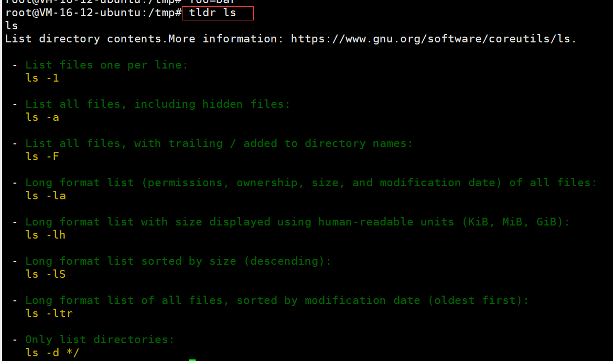
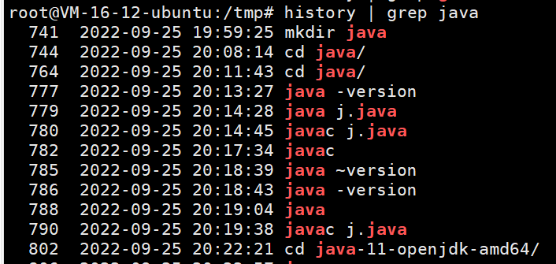
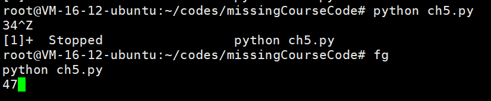
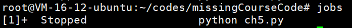
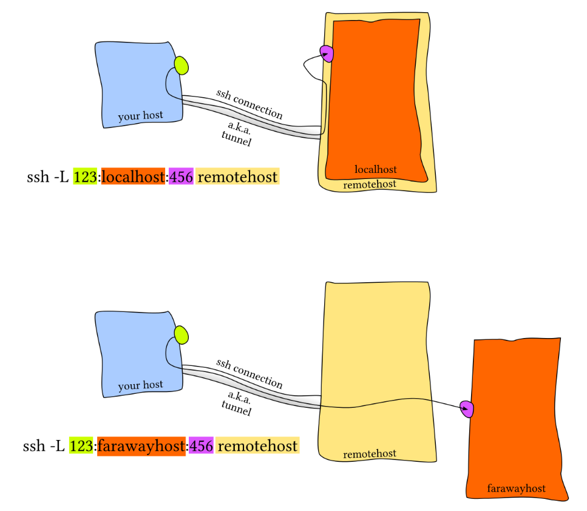
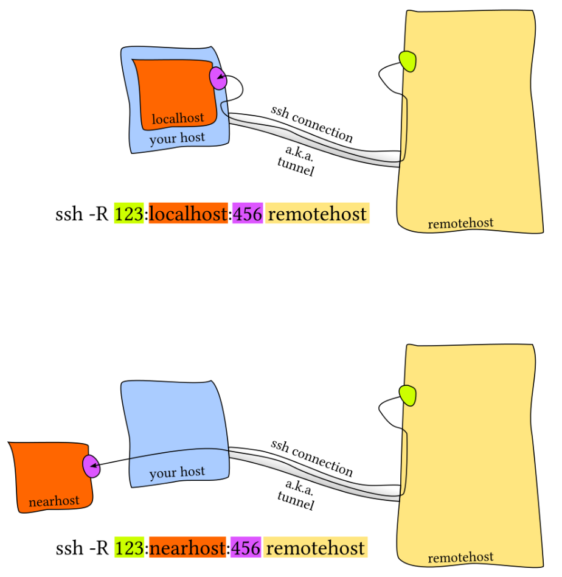

# 计算机教育缺失的一课

## ch1-The Shell

### 1. 使用shell

一个简单的shell命令的示例

```shell
missing:~$ date
Fri 10 Jan 2020 11:49:31 AM EST
missing:~$ 
```

执行了 `date` 这个程序，不出意料地，它打印出了当前的日期和时间。然后，shell 等待我们输入其他命令。我们可以在执行命令的同时向程序传递 *参数* ：

```shell
missing:~$ echo hello
hello
```

`echo` 程序将该参数打印出来。 shell 基于空格分割命令并进行解析，然后执行第一个单词代表的程序，并将后续的单词作为程序可以访问的参数。如果您希望传递的参数中包含空格（例如一个名为 My Photos 的文件夹），您要么用使用单引号，双引号将其包裹起来，要么使用转义符号 `\` 进行处理（`My\ Photos`）。

上例中，我们让 shell 执行 `echo` ，同时指定参数 `hello`。`echo` 程序将该参数打印出来。 shell 基于空格分割命令并进行解析，然后执行第一个单词代表的程序，并将后续的单词作为程序可以访问的参数。如果您希望传递的参数中包含空格（例如一个名为 My Photos 的文件夹），您要么用使用单引号，双引号将其包裹起来，要么使用转义符号 `\` 进行处理（`My\ Photos`）。

> shell 是如何知道去哪里寻找 `date` 或 `echo` 的呢

类似于 Python 或 Ruby，shell 是一个编程环境，所以它具备变量、条件、循环和函数（下一课进行讲解）。当你在 shell 中执行命令时，您实际上是在执行一段 shell 可以解释执行的简短代码。如果你要求 shell 执行某个指令，但是该指令并不是 shell 所了解的编程关键字，那么它会去咨询 *环境变量* `$PATH`，它会列出当 shell 接到某条指令时，进行程序搜索的路径

```shell
missing:~$ echo $PATH
/usr/local/sbin:/usr/local/bin:/usr/sbin:/usr/bin:/sbin:/bin
missing:~$ which echo
/bin/echo
missing:~$ /bin/echo $PATH
/usr/local/sbin:/usr/local/bin:/usr/sbin:/usr/bin:/sbin:/bin
```

当我们执行 `echo` 命令时，shell 了解到需要执行 `echo` 这个程序，随后它便会在 `$PATH` 中搜索由 `:` 所分割的一系列目录，基于名字搜索该程序。当找到该程序时便执行（假定该文件是 *可执行程序*，后续课程将详细讲解）。确定某个程序名代表的是哪个具体的程序，可以使用 `which` 程序。我们也可以绕过 `$PATH`，通过直接指定需要执行的程序的路径来执行该程序

### 2. 在shell中导航

shell 中的路径是一组被分割的目录，在 Linux 和 macOS 上使用 `/` 分割，而在Windows上是 `\`。路径 `/` 代表的是系统的根目录，所有的文件夹都包括在这个路径之下。

:warning:如果某个路径以 `/` 开头，那么它是一个 *绝对路径*，其他的都是 *相对路径* 。:warning:相对路径是指相对于当前工作目录的路径，当前工作目录可以使用 `pwd` 命令来获取。此外，切换目录需要使用 `cd` 命令。在路径中，`.` 表示的是当前目录，而 `..` 表示上级目录。

Linux中用户的主目录是`/home/用户名称`, 如果你的用户名是`user`, 你的主目录就是`/home/user`. 用户的`home`目录可以用波浪符号`~`替代, 例如临时文件目录`/home/user/Templates`可以简写为`~/Templates`. 

> ls命令

```shell
missing:~$ ls -l /home
drwxr-xr-x 1 missing  users  4096 Jun 15  2019 missing
```

这个参数可以更加详细地列出目录下文件或文件夹的信息。首先，本行第一个字符 `d` 表示 `missing` 是一个目录。然后接下来的九个字符，每三个字符构成一组。 （`rwx`）. 它们分别代表了文件所有者（`missing`），用户组（`users`） 以及其他所有人具有的权限。其中 `-` 表示该用户不具备相应的权限。从上面的信息来看，只有文件所有者可以修改（`w`），`missing` 文件夹 （例如，添加或删除文件夹中的文件）。为了进入某个文件夹，用户需要具备该文件夹以及其父文件夹的“搜索”权限（以“可执行”：`x`）权限表示。为了列出它的包含的内容，用户必须对该文件夹具备读权限（`r`）。对于文件来说，权限的意义也是类似的。注意，`/bin` 目录下的程序在最后一组，即表示所有人的用户组中，均包含 `x` 权限，也就是说任何人都可以执行这些程序。

> man命令

 `man` 会接受一个程序名作为参数，然后将它的文档（用户手册）展现给您。注意，使用 `q` 可以退出该程序。例如：

```shell
missing:~$ man ls
```

### 3. 在程序间创建连接

在 shell 中，程序有两个主要的“流”：它们的输入流和输出流。 当程序尝试读取信息时，它们会从输入流中进行读取，当程序打印信息时，它们会将信息输出到输出流中。 通常，一个程序的输入输出流都是您的终端。也就是，您的键盘作为输入，显示器作为输出。 但是，我们也可以重定向这些流

最简单的重定向是 `< file` 和 `> file`。这两个命令可以将程序的输入输出流分别重定向到文件：

```shell
missing:~$ echo hello > hello.txt
missing:~$ cat hello.txt
hello
missing:~$ cat < hello.txt
hello
missing:~$ cat < hello.txt > hello2.txt
missing:~$ cat hello2.txt
hello
```

还可以使用 `>>` 来向一个文件追加内容。使用管道（ *pipes* ），我们能够更好的利用文件重定向。 `|` 操作符允许我们将一个程序的输出和另外一个程序的输入连接起来：

```shell
missing:~$ ls -l / | tail -n1
drwxr-xr-x 1 root  root  4096 Jun 20  2019 var
missing:~$ curl --head --silent google.com | grep --ignore-case content-length | cut --delimiter=' ' -f2 219
```

### 4. 根用户

`sudo` 命令的作用是让用户可以以 su（super user 或 root 的简写）的身份执行一些操作。 当您遇到拒绝访问（permission denied）的错误时，通常是因为此时您必须是根用户才能操作。然而，请再次确认您是真的要执行此操作

有一件事情是您必须作为根用户才能做的，那就是向 `sysfs` 文件写入内容。系统被挂载在 `/sys` 下，`sysfs` 文件则暴露了一些内核（kernel）参数。 因此，您不需要借助任何专用的工具，就可以轻松地在运行期间配置系统内核。**注意 Windows 和 macOS 没有这个文件**。

## ch2-Shell工具和脚本

### 1. shell脚本概念

大多数shell都有自己的一套脚本语言，包括变量、控制流和自己的语法。shell脚本与其他脚本语言不同之处在于，shell 脚本针对 shell 所从事的相关工作进行来优化。因此，创建命令流程（pipelines）、将结果保存到文件、从标准输入中读取输入，这些都是 shell 脚本中的原生操作，这让它比通用的脚本语言更易用。

在bash中为变量赋值的语法是`foo=bar`，访问变量中存储的数值，其语法为 `$foo`。 需要注意的是，`foo = bar` （使用空格隔开）是不能正确工作的，因为解释器会调用程序`foo` 并将 `=` 和 `bar`作为参数。 总的来说，在shell脚本中使用空格会起到分割参数的作用，有时候可能会造成混淆，请务必多加检查。

Bash中的字符串通过`'` 和 `"`分隔符来定义，但是它们的含义并不相同：

- 以`'`定义的字符串为原义字符串，其中的变量不会被转义
- `"`定义的字符串会将变量值进行替换。

Bash中的字符串通过`'` 和 `"`分隔符来定义，但是它们的含义并不相同。以`'`定义的字符串为原义字符串，其中的变量不会被转义，而 `"`定义的字符串会将变量值进行替换。

```bash
foo=bar
echo "$foo"
# 打印 bar
echo '$foo'
# 打印 $foo
```

和其他大多数的编程语言一样，`bash`也支持`if`, `case`, `while` 和 `for` 这些控制流关键字。同样地， `bash` 也支持函数，它可以接受参数并基于参数进行操作。下面这个函数是一个例子，它会创建一个文件夹并使用`cd`进入该文件夹。

```bash
mcd () {
    mkdir -p "$1"
    cd "$1"
}
```

`bash`也支持`if`, `case`, `while` 和 `for` 这些控制流关键字。同样地， `bash` 也支持函数，它可以接受参数并基于参数进行操作。下面这个函数是一个例子，它会创建一个文件夹并使用`cd`进入该文件夹。

```bash
mcd () {
    mkdir -p "$1"
    cd "$1"
}
```

这里 `$1` 是脚本的第一个参数。与其他脚本语言不同的是，bash使用了很多特殊的变量来表示参数、错误代码和相关变量。下面是列举来其中一些变量，更完整的列表可以参考 [这里](https://www.tldp.org/LDP/abs/html/special-chars.html)。

- `$0` - 脚本名
- `$1` 到 `$9` - 脚本的参数。 `$1` 是第一个参数，依此类推。
- `$@` - 所有参数
- `$#` - 参数个数
- `$?` - 前一个命令的返回值
- `$$` - 当前脚本的进程识别码
- `!!` - 完整的上一条命令，包括参数。常见应用：当你因为权限不足执行命令失败时，可以使用 `sudo !!`再尝试一次。
- `$_` - 上一条命令的最后一个参数。如果你正在使用的是交互式 shell，你可以通过按下 `Esc` 之后键入 . 来获取这个值。

命令通常使用 `STDOUT`来返回输出值，使用`STDERR` 来返回错误及错误码，便于脚本以更加友好的方式报告错误。 返回码或退出状态是脚本/命令之间交流执行状态的方式。返回值0表示正常执行，其他所有非0的返回值都表示有错误发生。

退出码可以搭配 `&&`（与操作符）和 `||`（或操作符）使用，用来进行条件判断，决定是否执行其他程序。它们都属于短路[运算符](https://en.wikipedia.org/wiki/Short-circuit_evaluation)（short-circuiting） 同一行的多个命令可以用` ; `分隔。程序 `true` 的返回码永远是`0`，`false` 的返回码永远是`1`。让我们看几个例子:

```bash
false || echo "Oops, fail"
# Oops, fail

true || echo "Will not be printed"
#

true && echo "Things went well"
# Things went well

false && echo "Will not be printed"
#

false ; echo "This will always run"
# This will always run
```

另一个常见的模式是以变量的形式获取一个命令的输出，这可以通过 *命令替换*（*command substitution*）实现。

当您通过 `$( CMD )` 这样的方式来执行`CMD` 这个命令时，它的输出结果会替换掉 `$( CMD )` 。例如，如果执行 `for file in $(ls)` ，shell首先将调用`ls` ，然后遍历得到的这些返回值。还有一个冷门的类似特性是 *进程替换*（*process substitution*）， `<( CMD )` 会执行 `CMD` 并将结果输出到一个临时文件中，并将 `<( CMD )` 替换成临时文件名。这在我们希望返回值通过文件而不是STDIN传递时很有用。例如， `diff <(ls foo) <(ls bar)` 会显示文件夹 `foo` 和 `bar` 中文件的区别。

说了很多，现在该看例子了，下面这个例子展示了一部分上面提到的特性。这段脚本会遍历我们提供的参数，使用`grep` 搜索字符串 `foobar`，如果没有找到，则将其作为注释追加到文件中。

```bash
#!/bin/bash

echo "Starting program at $(date)" # date会被替换成日期和时间

echo "Running program $0 with $# arguments with pid $$"

for file in "$@"; do
    grep foobar "$file" > /dev/null 2> /dev/null
    # 如果模式没有找到，则grep退出状态为 1
    # 我们将标准输出流和标准错误流重定向到Null，因为我们并不关心这些信息
    # 在bash中进行比较时，尽量使用双方括号 [[ ]] 而不是单方括号 [ ]，这样会降低犯错的几率，尽管这样并不能兼容 sh
    if [[ $? -ne 0 ]]; then
        echo "File $file does not have any foobar, adding one"
        echo "# foobar" >> "$file"
    fi
done
```

> shell的通配

当执行脚本时，我们经常需要提供形式类似的参数。bash使我们可以轻松的实现这一操作，它可以基于文件扩展名展开表达式。这一技术被称为shell的 *通配*（*globbing*）：

- 通配符 - 当你想要利用通配符进行匹配时，你可以分别使用 `?` 和 `*` 来匹配**一个**或**任意**个字符。例如，对于文件`foo`, `foo1`, `foo2`, `foo10` 和 `bar`,

    `rm foo?`这条命令会删除`foo1` 和 `foo2` ，而`rm foo*` 则会删除除了`bar`之外的所有文件。

- 花括号`{}` - 当你有一系列的指令，其中包含一段公共子串时，可以用花括号来自动展开这些命令。这在批量移动或转换文件时非常方便：

    ```bash
    convert image.{png,jpg}
    # 会展开为
    convert image.png image.jpg
    
    cp /path/to/project/{foo,bar,baz}.sh /newpath
    # 会展开为
    cp /path/to/project/foo.sh /path/to/project/bar.sh /path/to/project/baz.sh /newpath
    
    # 也可以结合通配使用
    mv *{.py,.sh} folder
    # 会移动所有 *.py 和 *.sh 文件
    
    mkdir foo bar
    
    # 下面命令会创建foo/a, foo/b, ... foo/h, bar/a, bar/b, ... bar/h这些文件
    touch {foo,bar}/{a..h}
    touch foo/x bar/y
    # 比较文件夹 foo 和 bar 中包含文件的不同
    diff <(ls foo) <(ls bar)
    # 输出
    # < x
    # ---
    # > y
    ```

    > 注意：脚本并不一定只有用 bash 写才能在终端里调用

比如说，这是一段 Python 脚本，作用是将输入的参数倒序输出：

```python
#!/usr/local/bin/python
import sys
for arg in reversed(sys.argv[1:]):
    print(arg)
```

内核知道去用 python 解释器而不是 shell 命令来运行这段脚本，是因为脚本的开头第一行的 [shebang](https://en.wikipedia.org/wiki/Shebang_(Unix))。

在 `shebang` 行中使用 [`env`](https://man7.org/linux/man-pages/man1/env.1.html) 命令是一种好的实践，它会利用环境变量中的程序来解析该脚本，这样就提高来您的脚本的可移植性。`env` 会利用我们第一节讲座中介绍过的`PATH` 环境变量来进行定位。 例如，使用了`env`的shebang看上去是这样的`#!/usr/bin/env python`。

> 解释伴随行shebang

Shebang通常出现在类Unix系统的脚本中第一行，作为前两个字符。在Shebang之后，可以有一个或数个空白字符，后接解释器的绝对路径，用于指明执行这个脚本文件的解释器。在直接调用脚本时，系统的程序载入器会分析 Shebang 后的内容，将这些内容作为解释器指令，并调用该指令，将载有 Shebang 的文件路径作为该解释器的参数，执行脚本，从而使得脚本文件的调用方式与普通的可执行文件类似。例如，以指令`#!/bin/sh`开头的文件，在执行时会实际调用 /bin/sh 程序（通常是 Bourne shell 或兼容的 shell，例如 bash、dash 等）来执行。
由于 # 符号在许多脚本语言中都是注释标识符，Shebang 的内容会被这些脚本解释器自动忽略。 在 # 字符不是注释标识符的语言中，例如 Scheme，解释器也可能忽略以 #! 开头的首行内容，以提供与 Shebang 的兼容性。

> shell函数和脚本的不同点

- 函数只能与shell使用相同的语言，脚本可以使用任意语言。因此在脚本中包含 `shebang` 是很重要的。
- 函数仅在定义时被加载，脚本会在每次被执行时加载。这让函数的加载比脚本略快一些，但每次修改函数定义，都要重新加载一次。
- 函数会在当前的shell环境中执行，脚本会在单独的进程中执行。因此，函数可以对环境变量进行更改，比如改变当前工作目录，脚本则不行。脚本需要使用 [`export`](httsp://man7.org/linux/man-pages/man1/export.1p.html) 将环境变量导出，并将值传递给环境变量。
- 与其他程序语言一样，函数可以提高代码模块性、代码复用性并创建清晰性的结构。shell脚本中往往也会包含它们自己的函数定义。

### 2. Shell工具

#### 2.1 查看命令如何使用

1. 最常用的方法是为对应的命令行添加`-h` 或 `--help` 标记。
2. 另外一个更详细的方法则是使用`man` 命令。[`man`](https://man7.org/linux/man-pages/man1/man.1.html) 命令是手册（manual）的缩写，它提供了命令的用户手册。

事实上，目前我们给出的所有命令的说明链接，都是网页版的Linux命令手册。即使是您安装的第三方命令，前提是开发者编写了手册并将其包含在了安装包中。在交互式的、基于字符处理的终端窗口中，一般也可以通过 `:help` 命令或键入 `?` 来获取帮助。

3. 有时候手册内容太过详实，让我们难以在其中查找哪些最常用的标记和语法。 [TLDR pages](https://tldr.sh/) 是一个很不错的替代品，它提供了一些命令最常用的案例，可以帮助您快速找到正确的选项。



#### 2.2 查找文件

（1）find

所有的类UNIX系统都包含一个名为 [`find`](https://man7.org/linux/man-pages/man1/find.1.html) 的工具，它是 shell 上用于查找文件的绝佳工具。`find`命令会递归地搜索符合条件的文件，例如：

```bash
# 查找所有名称为src的文件夹
find . -name src -type d
# 查找所有文件夹路径中包含test的python文件
find . -path '*/test/*.py' -type f
# 查找前一天修改的所有文件
find . -mtime -1
# 查找所有大小在500k至10M的tar.gz文件
find . -size +500k -size -10M -name '*.tar.gz'
```

除了列出所寻找的文件之外，find 还能对所有查找到的文件进行操作。这能极大地简化一些单调的任务。

```bash
# 删除全部扩展名为.tmp 的文件
find . -name '*.tmp' -exec rm {} \;
# 查找全部的 PNG 文件并将其转换为 JPG
find . -name '*.png' -exec convert {} {}.jpg \;
```

（2）fd

[`fd`](https://github.com/sharkdp/fd) 是一个更简单、更快速、更友好的程序，它可以用来作为`find`的替代品。它有很多不错的默认设置，例如输出着色、默认支持正则匹配、支持unicode并且我认为它的语法更符合直觉。以模式`PATTERN` 搜索的语法是 `fd PATTERN`。

（3）locate

`locate` 使用一个由 [`updatedb`](https://man7.org/linux/man-pages/man1/updatedb.1.html)负责更新的数据库，在大多数系统中 `updatedb` 都会通过 [`cron`](https://man7.org/linux/man-pages/man8/cron.8.html) 每日更新。这便需要我们在速度和时效性之间作出权衡。而且，`find` 和类似的工具可以通过别的属性比如文件大小、修改时间或是权限来查找文件，`locate`则只能通过文件名。 [这里](https://unix.stackexchange.com/questions/60205/locate-vs-find-usage-pros-and-cons-of-each-other)有一个更详细的对比。

#### 2.3 查找代码

很多类UNIX的系统都提供了[`grep`](https://man7.org/linux/man-pages/man1/grep.1.html)命令，它是用于对输入文本进行匹配的通用工具。

`grep` 有很多选项，这也使它成为一个非常全能的工具。其中经常使用的有 `-C` ：获取查找结果的上下文（Context）；`-v` 将对结果进行反选（Invert），也就是输出不匹配的结果。举例来说， `grep -C 5` 会输出匹配结果前后五行。当需要搜索大量文件的时候，使用 `-R` 会递归地进入子目录并搜索所有的文本文件。

#### 2.4 查找shell命令

`history` 命令允许您以程序员的方式来访问shell中输入的历史命令。这个命令会在标准输出中打印shell中的里面命令。如果我们要搜索历史记录，则可以利用管道将输出结果传递给 `grep` 进行模式搜索。例如 `history | grep find` 会打印包含find子串的命令：



对于大多数的shell来说，也可以使用 `Ctrl+R` 对命令历史记录进行回溯搜索。敲 `Ctrl+R` 后可以输入子串来自动利用`history | grep xxx`进行匹配，查找历史命令行。

> 递归的查找文件夹中最近使用的文件
>
> 更通用的做法，按照最近的使用时间列出文件

```bash
find . -type f -print0 | xargs -0 ls -lt | head -1
```

当文件数量较多时，上面的命令会得出错误结果，解决办法是增加 `-mmin `条件，先将最近修改的文件进行初步筛选再交给ls进行排序显示 :

```bash
find . -type f -mmin -60 -print0 | xargs -0 ls -lt | head -10
```

#### 2.5 文件夹导航

如何高效地在目录 间随意切换呢？有很多简便的方法可以做到，比如设置alias，使用 [ln -s](https://man7.org/linux/man-pages/man1/ln.1.html) 创建符号连接等。

更简便的，使用[`fasd`](https://github.com/clvv/fasd)和 [autojump](https://github.com/wting/autojump) 这两个工具来查找最常用或最近使用的文件和目录。

Fasd 基于 [*frecency* ](https://developer.mozilla.org/en-US/docs/Mozilla/Tech/Places/Frecency_algorithm)对文件和文件排序，也就是说它会同时针对频率（*frequency*）和时效（*recency*）进行排序。默认情况下，`fasd`使用命令 `z` 帮助我们快速切换到最常访问的目录。例如， 如果您经常访问`/home/user/files/cool_project` 目录，那么可以直接使用 `z cool` 跳转到该目录。对于 autojump，则使用`j cool`代替即可。

## ch3-Vim

### 1. Vim的哲学

Vim 是一个能跟上思维速度的编辑器。

Vim 是一个*多模态*编辑器：它对于插入文字和操纵文字有不同的模式。Vim 是可编程的（可以使用 Vimscript 或者像 Python 一样的其他程序语言），Vim 的接口本身也是一个程序语言：键入操作（以及其助记名） 是命令，这些命令也是可组合的。Vim 避免了使用鼠标，因为那样太慢了；Vim 甚至避免用 上下左右键因为那样需要太多的手指移动。

### 2. 编辑模式

多种操作模式：

1. **正常模式**：在文件中四处移动光标进行修改
2. **插入模式**：插入文本
3. **替换模式**：替换文本
4. **可视化模式**（一般，行，块）：选中文本块
5. **命令模式**：用于执行命令

在默认设置下，Vim 会在左下角显示当前的模式。Vim 启动时的默认模式是正常模式。

1. 可以按下 `<ESC>`（退出键）从任何其他模式返回正常模式
2. 在正常模式，键入 `i` 进入插入 模式
3. `R` 进入替换模式
4. `v` 进入可视（一般）模式，`V` 进入可视（行）模式，`<C-v>` （Ctrl-V, 有时也写作 `^V`）进入可视（块）模式
5. `:` 进入命令模式。

### 3. 基本操作

#### 3.1 插入文本

在正常模式，键入 `i` 进入插入模式。现在 Vim 跟很多其他的编辑器一样，直到你键入 `<ESC>` 返回正常模式

#### 3.2 缓存，标签页和窗口

Vim 会维护一系列打开的文件，称为“缓存”。一个 Vim 会话包含一系列标签页，每个标签页包含 一系列窗口（分隔面板）。每个窗口显示一个缓存。跟网页浏览器等其他你熟悉的程序不一样的是， 缓存和窗口不是一一对应的关系；窗口只是视角。一个缓存可以在*多个*窗口打开，甚至在同一 个标签页内的多个窗口打开。这个功能其实很好用，比如在查看同一个文件的不同部分的时候。

Vim 默认打开一个标签页，这个标签也包含一个窗口。

#### 3.3 命令行

在正常模式下键入 `:` 进入命令行模式。 在键入 `:` 后，你的光标会立即跳到屏幕下方的命令行。 这个模式有很多功能，包括打开，保存，关闭文件，以及 [退出 Vim](https://twitter.com/iamdevloper/status/435555976687923200)。

1. `:q` 退出（关闭窗口）
2. `:w` 保存（写）
3. `:wq` 保存然后退出
4. `:e {文件名}` 打开要编辑的文件
5. `:ls` 显示打开的缓存
6. `:help {标题}` 打开帮助文档
    1. `:help :w` 打开 `:w` 命令的帮助文档
    2. `:help w` 打开 `w` 移动的帮助文档

### 4. Vim 的接口其实是一种编程语言

#### 4.1 移动

多数时候你会在正常模式下，使用移动命令在缓存中导航。在 Vim 里面移动也被称为 “名词”， 因为它们指向文字块。

- 基本移动: `hjkl` （左， 下， 上， 右）
- 词： `w` （下一个词）， `b` （词初）， `e` （词尾）
- 行： `0` （行初）， `^` （第一个非空格字符）， `$` （行尾）
- 屏幕： `H` （屏幕首行）， `M` （屏幕中间）， `L` （屏幕底部）
- :warning:常用:warning:翻页： `Ctrl-u` （上翻）， `Ctrl-d` （下翻）
- :warning:常用:warning:文件： `gg` （文件头）， `G` （文件尾）
- 行数： `:{行数}<CR>` 或者 `{行数}G` ({行数}为行数)
- 杂项： `%` （找到配对，比如括号或者 /* */ 之类的注释对）
- 查找： `f{字符}`， `t{字符}`， `F{字符}`， `T{字符}`
    - 查找/到 向前/向后 在本行的{字符}
    - `,` / `;` 用于导航匹配
- :warning:常用:warning:搜索: `/{正则表达式}`, `n` / `N` 用于导航匹配

#### 4.2 选择

可视化模式:

- 可视化：`v`
- 可视化行： `V`
- 可视化块：`Ctrl+v`

可以用移动命令来选中。

#### 4.3 编辑

所有你需要用鼠标做的事， 你现在都可以用键盘：采用编辑命令和移动命令的组合来完成。 这就是 Vim 的界面开始看起来像一个程序语言的时候。Vim 的编辑命令也被称为 “动词”， 因为动词可以施动于名词。

- i进入插入模式
    - 但是对于操纵/编辑文本，不单想用退格键完成
- `O` / `o` 在之上/之下插入行
- d{移动命令}删除 {移动命令}
    - 例如，`dw` 删除词, `d$` 删除到行尾, `d0` 删除到行头。
- c{移动命令}改变 {移动命令}
    - 例如，`cw` 改变词
    - 比如 `d{移动命令}` 再 `i`
- `x` 删除字符（等同于 `dl`）
- `s` 替换字符（等同于 `xi`）
- 可视化模式 + 操作
    - 选中文字, `d` 删除 或者 `c` 改变
- `u` 撤销, `<C-r>` 重做
- `y` 复制 / “yank” （其他一些命令比如 `d` 也会复制）
- `p` 粘贴
- 更多值得学习的: 比如 `~` 改变字符的大小写

#### 4.4 计数

可以用一个计数来结合“名词”和“动词”，这会执行指定操作若干次。

- `3w` 向前移动三个词
- `5j` 向下移动5行
- `7dw` 删除7个词

#### 4.5 修饰语

你可以用修饰语改变“名词”的意义。修饰语有 `i`，表示“内部”或者“在内“，和 `a`， 表示”周围“。

- `ci(` 改变当前括号内的内容
- `ci[` 改变当前方括号内的内容
- `da'` 删除一个单引号字符串， 包括周围的单引号

### 5. 自定义Vim

Vim 由一个位于 `~/.vimrc` 的文本配置文件（包含 Vim 脚本命令）。

### 6. 扩展Vim

从 Vim 8.0 开始可以使用内置的插件管理系统。只需要创建一个 `~/.vim/pack/vendor/start/` 的文件夹，然后把插件放到这里（比如通过 `git clone`）。

[Vim Awesome](https://vimawesome.com/) 有各种很棒的插件。 这个话题也有很多博客文章：搜索 “best Vim plugins”。

### 7. 扩展资料

- `vimtutor` 是一个 Vim 安装时自带的教程
- [Vim Adventures](https://vim-adventures.com/) 是一个学习使用 Vim 的游戏
- [Vim Tips Wiki](http://vim.wikia.com/wiki/Vim_Tips_Wiki)
- [Vim Advent Calendar](https://vimways.org/2019/) 有很多 Vim 小技巧
- [Vim Golf](http://www.vimgolf.com/) 是用 Vim 的用户界面作为程序语言的 [code golf](https://en.wikipedia.org/wiki/Code_golf)
- [Vi/Vim Stack Exchange](https://vi.stackexchange.com/)
- [Vim Screencasts](http://vimcasts.org/)
- [Practical Vim](https://pragprog.com/titles/dnvim2/)（书籍）

## ch4-数据整理

### 1. 正则表达式

例如`/.*Disconnected from /`。正则表达式通常以（尽管并不总是） `/`开始和结束。大多数的 ASCII 字符都表示它们本来的含义，但是有一些字符确实具有表示匹配行为的“特殊”含义。不同字符所表示的含义，根据正则表达式的实现方式不同，也会有所变化。常见的模式有：

- `.` 除换行符之外的”任意单个字符”
- `*` 匹配前面字符零次或多次
- `+` 匹配前面字符一次或多次
- `[abc]` 匹配 `a`, `b` 和 `c` 中的任意一个
- `(RX1|RX2)` 任何能够匹配`RX1` 或 `RX2`的结果
- `^` 行首
- `$` 行尾

## ch5-命令行环境

在本章中学习如何同时执行多个不同的进程并追踪它们的状态、如何停止或暂停某个进程以及如何使进程在后台运行。

还包括一些能够改善您的 shell 及其他工具的工作流的方法，这主要是通过定义别名或基于配置文件对其进行配置来实现的。这些方法都可以帮您节省大量的时间。例如，仅需要执行一些简单的命令，我们就可以在所有的主机上使用相同的配置。我们还会学习如何使用 SSH 操作远端机器。

### 1. 任务控制

#### 1.1 结束进程

shell 会使用 UNIX 提供的**信号机制执行进程间通信**。当一个进程接收到信号时，它会停止执行、处理该信号并基于信号传递的信息来改变其执行。就这一点而言，信号是一种*软件中断*。例如，当我们输入 `Ctrl-C` 时，shell 会发送一个`SIGINT` 信号到进程。

尽管 `SIGINT` 和 `SIGQUIT` 都常常用来发出和终止程序相关的请求。`SIGTERM` 则是一个更加通用的、也更加优雅地退出信号。为了发出这个信号我们需要使用 [`kill`](https://www.man7.org/linux/man-pages/man1/kill.1.html) 命令, 它的语法是： `kill -TERM <PID>`。

#### 1.2 暂停和后台执行进程

信号可以让进程做其他的事情，而不仅仅是终止它们。例如，`SIGSTOP` 会让进程暂停。在终端中，键入 `Ctrl-Z` 会让 shell 发送 `SIGTSTP` 信号，`SIGTSTP`是 Terminal Stop 的缩写（即`terminal`版本的SIGSTOP）

:warning:可以使用 [`fg`](https://www.man7.org/linux/man-pages/man1/fg.1p.html) 或 [`bg`](http://man7.org/linux/man-pages/man1/bg.1p.html) 命令恢复暂停的工作。它们分别表示在前台继续或在后台继续。:warning:



[`jobs`](http://man7.org/linux/man-pages/man1/jobs.1p.html) 命令会列出当前终端会话中尚未完成的全部任务。您可以使用 pid 引用这些任务（也可以用 [`pgrep`](https://www.man7.org/linux/man-pages/man1/pgrep.1.html) 找出 pid）。更加符合直觉的操作是您可以使用百分号 + 任务编号（`jobs` 会打印任务编号）来选取该任务。如果要选择最近的一个任务，可以使用 `$!` 这一特殊参数。



命令中的 `&` 后缀可以让命令在直接在后台运行，这使得您可以直接在 shell 中继续做其他操作，不过它此时还是会使用 shell 的标准输出，这一点有时会比较恼人（这种情况可以使用 shell 重定向处理）。

让已经在运行的进程转到后台运行，您可以键入`Ctrl-Z` ，然后紧接着再输入`bg`。注意，后台的进程仍然是您的终端进程的子进程，一旦您关闭终端（会发送另外一个信号`SIGHUP`），这些后台的进程也会终止。为了防止这种情况发生，您可以使用 [`nohup`](https://www.man7.org/linux/man-pages/man1/nohup.1.html) (一个用来忽略 `SIGHUP` 的封装) 来运行程序。针对已经运行的程序，可以使用`disown` 。除此之外，您可以使用终端多路复用器来实现，下一章节会进行详细地探讨。

下面这个简单的会话中展示来了些概念的应用。

```bash
$ sleep 1000
^Z
[1]  + 18653 suspended  sleep 1000

$ nohup sleep 2000 &
[2] 18745
appending output to nohup.out

$ jobs
[1]  + suspended  sleep 1000
[2]  - running    nohup sleep 2000

$ bg %1
[1]  - 18653 continued  sleep 1000

$ jobs
[1]  - running    sleep 1000
[2]  + running    nohup sleep 2000

$ kill -STOP %1
[1]  + 18653 suspended (signal)  sleep 1000

$ jobs
[1]  + suspended (signal)  sleep 1000
[2]  - running    nohup sleep 2000

$ kill -SIGHUP %1
[1]  + 18653 hangup     sleep 1000

$ jobs
[2]  + running    nohup sleep 2000

$ kill -SIGHUP %2

$ jobs
[2]  + running    nohup sleep 2000

$ kill %2
[2]  + 18745 terminated  nohup sleep 2000

$ jobs
```

`SIGKILL` 是一个特殊的信号，它不能被进程捕获并且它会马上结束该进程。不过这样做会有一些副作用，例如留下孤儿进程。

### 2. 终端多路复用（以tmux为例）

现在最流行的终端多路器是 [`tmux`](https://www.man7.org/linux/man-pages/man1/tmux.1.html)。`tmux` 是一个高度可定制的工具，可以使用相关快捷键创建多个标签页并在它们间导航。像 [`tmux`](https://www.man7.org/linux/man-pages/man1/tmux.1.html) 这类的终端多路复用器可以允许我们基于面板和标签分割出多个终端窗口，这样的好处是：

1. 可以同时与多个 shell 会话进行交互
2. 使我们可以分离当前终端会话并在将来重新连接。

`tmux` 的快捷键都是类似 `<C-b> x` 这样的组合，即需要先按下`Ctrl+b`，松开后再按下 `x`。`tmux` 中对象的继承结构如下：

- 会话：每个会话都是一个独立的工作区，其中包含一个或多个窗口
    - `tmux` 开始一个新的会话
    - `tmux new -s NAME` 以指定名称开始一个新的会话
    - `tmux ls` 列出当前所有会话
    - 在 `tmux` 中输入 `<C-b> d` ，将当前会话分离
    - `tmux a` 重新连接最后一个会话。您也可以通过 `-t` 来指定具体的会话
- 窗口：相当于编辑器或是浏览器中的标签页，从视觉上将一个会话分割为多个部分
    - `<C-b> c` 创建一个新的窗口，使用 `<C-d>`关闭
    - `<C-b> N` 跳转到第 *N* 个窗口，注意每个窗口都是有编号的
    - `<C-b> p` 切换到前一个窗口
    - `<C-b> n` 切换到下一个窗口
    - `<C-b> ,` 重命名当前窗口
    - `<C-b> w` 列出当前所有窗口
- 面板：像 vim 中的分屏一样，面板使我们可以在一个屏幕里显示多个 shell
    - `<C-b> "` 水平分割
    - `<C-b> %` 垂直分割
    - `<C-b> <方向>` 切换到指定方向的面板，<方向> 指的是键盘上的方向键
    - `<C-b> z` 切换当前面板的缩放
    - `<C-b> [` 开始往回卷动屏幕。您可以按下空格键来开始选择，回车键复制选中的部分
    - `<C-b> <空格>` 在不同的面板排布间切换

扩展阅读：

1.  [这里](https://www.hamvocke.com/blog/a-quick-and-easy-guide-to-tmux/) 是一份 `tmux` 快速入门教程
2.  [这里]([Tmux使用手册 | louis blog (louiszhai.github.io)](http://louiszhai.github.io/2017/09/30/tmux/?utm_source=wechat_session&utm_medium=social&utm_oi=1327979382099333120#导读)) 是一份 `tmux` 中文使用手册
3.  [而这一篇](http://linuxcommand.org/lc3_adv_termmux.php) 文章则更加详细，它同时包含了 `screen` 命令（也是一款终端复用软件）。您也许想要掌握 [`screen`](https://www.man7.org/linux/man-pages/man1/screen.1.html) 命令，因为在大多数 UNIX 系统中都默认安装有该程序。

### 3. 别名

 shell 的别名相当于一个长命令的缩写，shell 会自动将其替换成原本的命令。例如，bash 中的别名语法如下：

```shell
alias alias_name="command_to_alias arg1 arg2"
```

注意， `=`两边是没有空格的，因为 [`alias`](https://www.man7.org/linux/man-pages/man1/alias.1p.html) 是一个 shell 命令，它只接受一个参数。

别名有许多很方便的特性:

```shell
# 创建常用命令的缩写
alias ll="ls -lh"

# 能够少输入很多
alias gs="git status"
alias gc="git commit"
alias v="vim"

# 手误打错命令也没关系
alias sl=ls

# 重新定义一些命令行的默认行为
alias mv="mv -i"           # -i prompts before overwrite
alias mkdir="mkdir -p"     # -p make parent dirs as needed
alias df="df -h"           # -h prints human readable format

# 别名可以组合使用
alias la="ls -A"
alias lla="la -l"

# 在忽略某个别名
\ls
# 或者禁用别名
unalias la

# 获取别名的定义
alias ll
# 会打印 ll='ls -lh'
```

值得注意的是，在默认情况下 shell 并不会保存别名。为了让别名持续生效，需要将配置放进 shell 的启动文件里，像是`.bashrc` 或 `.zshrc`，下一节我们就会讲到。

```shell
vim ~/.bashrc
```

### 4. 配置文件

很多程序的配置都是通过纯文本格式的被称作**点文件**的配置文件来完成的（之所以称为点文件，是因为它们的文件名以 `.` 开头，例如 `~/.vimrc`。也正因为此，它们默认是隐藏文件，`ls`并不会显示它们）。

shell 的配置也是通过这类文件完成的。在启动时， shell 程序会读取很多文件以加载其配置项。根据 shell 本身的不同，从登录开始还是以交互的方式完成这一过程可能会有很大的不同。

对于 `bash`来说，在大多数系统下，可以通过编辑 `.bashrc` 或 `.bash_profile` 来进行配置。在文件中您可以添加需要在启动时执行的命令，例如上文我们讲到过的**别名**，或者是您的**环境变量**。

实际上，很多程序都要求您在 shell 的配置文件中包含一行类似 `export PATH="$PATH:/path/to/program/bin"` 的命令，这样才能确保这些程序能够被 shell 找到。

还有一些其他的工具也可以通过*点文件*进行配置：

- `bash` - `~/.bashrc`, `~/.bash_profile`
- `git` - `~/.gitconfig`
- `vim` - `~/.vimrc` 和 `~/.vim` 目录
- `ssh` - `~/.ssh/config`
- `tmux` - `~/.tmux.conf`

> 如何管理配置文件

配置文件它们应该在它们的文件夹下，并使用版本控制系统进行管理，然后通过脚本将其 **符号链接** 到需要的地方。这么做有如下好处：

- **安装简单**: 如果您登录了一台新的设备，在这台设备上应用您的配置只需要几分钟的时间；
- **可以执行**: 您的工具在任何地方都以相同的配置工作
- **同步**: 在一处更新配置文件，可以同步到其他所有地方
- **变更追踪**: 您可能要在整个程序员生涯中持续维护这些配置文件，而对于长期项目而言，版本历史是非常重要的

配置文件中需要放些什么？可以通过在线文档和[帮助手册](https://en.wikipedia.org/wiki/Man_page)了解所使用工具的设置项。另一个方法是在网上搜索有关特定程序的文章，作者们在文章中会分享他们的配置。还有一种方法就是直接浏览其他人的配置文件：您可以在这里找到无数的[dotfiles 仓库](https://github.com/search?o=desc&q=dotfiles&s=stars&type=Repositories) —— 其中最受欢迎的那些可以在[这里](https://github.com/mathiasbynens/dotfiles)找到（我们建议您不要直接复制别人的配置）。[这里](https://dotfiles.github.io/) 也有一些非常有用的资源。

> 可移植性

配置文件的一个常见的痛点是它可能并不能在多种设备上生效。例如，如果您在不同设备上使用的操作系统或者 shell 是不同的，则配置文件是无法生效的。或者，有时您仅希望特定的配置只在某些设备上生效。

有一些技巧可以轻松达成这些目的。如果配置文件 if 语句，则您可以借助它针对不同的设备编写不同的配置。例如，您的 shell 可以这样做：

```shell
if [[ "$(uname)" == "Linux" ]]; then {do_something}; fi

# 使用和 shell 相关的配置时先检查当前 shell 类型
if [[ "$SHELL" == "zsh" ]]; then {do_something}; fi

# 您也可以针对特定的设备进行配置
if [[ "$(hostname)" == "myServer" ]]; then {do_something}; fi
```

如果配置文件支持 include 功能，您也可以多加利用。例如：`~/.gitconfig` 可以这样编写：

```shell
[include]
    path = ~/.gitconfig_local
```

然后我们可以在日常使用的设备上创建配置文件 `~/.gitconfig_local` 来包含与该设备相关的特定配置。您甚至应该创建一个单独的代码仓库来管理这些与设备相关的配置。

如果您希望在不同的程序之间共享某些配置，该方法也适用。例如，如果您想要在 `bash` 和 `zsh` 中同时启用一些别名，您可以把它们写在 `.aliases` 里，然后在这两个 shell 里应用：

```shell
# Test if ~/.aliases exists and source it
if [ -f ~/.aliases ]; then
    source ~/.aliases
fi
```

### 5. 远端设备与SSH

通过如下命令，可以使用 `ssh` 连接到其他服务器：

```shell
ssh foo@bar.mit.edu
```

这里我们尝试以用户名 `foo` 登录服务器 `bar.mit.edu`。服务器可以通过 URL 指定（例如`bar.mit.edu`），也可以使用 IP 指定（例如`foobar@192.168.1.42`）。后面会介绍如何修改 ssh 配置文件使我们可以用类似 `ssh bar` 这样的命令来登录服务器。

#### 5.1 执行命令

`ssh` 的一个经常被忽视的特性是它可以直接远程执行命令。 `ssh foobar@server ls` 可以直接在用foobar的命令下执行 `ls` 命令。 想要配合管道来使用也可以， `ssh foobar@server ls | grep PATTERN` 会在本地查询远端 `ls` 的输出而 `ls | ssh foobar@server grep PATTERN` 会在远端对本地 `ls` 输出的结果进行查询。

#### 5.2 SSH密钥

基于密钥的验证机制使用了密码学中的公钥，我们只需要向服务器证明客户端持有对应的私钥，而不需要公开其私钥。这样您就可以避免每次登录都输入密码的麻烦了秘密就可以登录。不过，私钥(通常是 `~/.ssh/id_rsa` 或者 `~/.ssh/id_ed25519`) 等效于您的密码，所以一定要好好保存它。

> 密钥生成

使用 [`ssh-keygen`](http://man7.org/linux/man-pages/man1/ssh-keygen.1.html) 命令可以生成一对密钥：

```
ssh-keygen -o -a 100 -t ed25519 -f ~/.ssh/id_ed25519
```

您可以为密钥设置密码，防止有人持有您的私钥并使用它访问您的服务器。您可以使用 [`ssh-agent`](https://www.man7.org/linux/man-pages/man1/ssh-agent.1.html) 或 [`gpg-agent`](https://linux.die.net/man/1/gpg-agent) ，这样就不需要每次都输入该密码了。

如果您曾经配置过使用 SSH 密钥推送到 GitHub，那么可能您已经完成了[这里](https://help.github.com/articles/connecting-to-github-with-ssh/)介绍的这些步骤，并且已经有了一个可用的密钥对。要检查您是否持有密码并验证它，您可以运行 `ssh-keygen -y -f /path/to/key`。

> 基于密钥的认证机制

`ssh` 会查询 `.ssh/authorized_keys` 来确认那些用户可以被允许登录。您可以通过下面的命令将一个公钥拷贝到这里：

```shell
cat .ssh/id_ed25519 | ssh foobar@remote 'cat >> ~/.ssh/authorized_keys'
```

如果支持 `ssh-copy-id` 的话，可以使用下面这种更简单的解决方案：

```shell
ssh-copy-id -i .ssh/id_ed25519.pub foobar@remote
```

#### 5.3 通过SSH复制文件

使用 ssh 复制文件有很多方法：

- `ssh+tee`, 最简单的方法是执行 `ssh` 命令，然后通过这样的方法利用标准输入实现 `cat localfile | ssh remote_server tee serverfile`。回忆一下，[`tee`](https://www.man7.org/linux/man-pages/man1/tee.1.html) 命令会将标准输出写入到一个文件；

- [`scp`](https://www.man7.org/linux/man-pages/man1/scp.1.html) ：当需要拷贝大量的文件或目录时，使用`scp` 命令则更加方便，因为它可以方便的遍历相关路径。语法如下：

    `scp path/to/local_file remote_host:path/to/remote_file`；

- [`rsync`](https://www.man7.org/linux/man-pages/man1/rsync.1.html) 对 `scp` 进行了改进，它可以检测本地和远端的文件以防止重复拷贝。它还可以提供一些诸如符号连接、权限管理等精心打磨的功能。甚至还可以基于 `--partial`标记实现断点续传。`rsync` 的语法和`scp`类似。

#### 5.4 端口转发

很多情况下我们都会遇到软件需要监听特定设备的端口。如果是在您的本机，可以使用 `localhost:PORT` 或 `127.0.0.1:PORT`。但是如果需要监听远程服务器的端口该如何操作呢？这种情况下远端的端口并不会直接通过网络暴露给您。

此时就需要进行 *端口转发*。端口转发有两种，本地端口转发和远程端口转发（参见下图，该图片引用自这篇[StackOverflow 文章](https://unix.stackexchange.com/questions/115897/whats-ssh-port-forwarding-and-whats-the-difference-between-ssh-local-and-remot)）中的图片。

本地端口转发：



远程端口转发：



常见的情景是使用本地端口转发，即远端设备上的服务监听一个端口，而您希望在本地设备上的一个端口建立连接并转发到远程端口上。例如，我们在远端服务器上运行 Jupyter notebook 并监听 `8888` 端口。 然后，建立从本地端口 `9999` 的转发，使用 `ssh -L 9999:localhost:8888 foobar@remote_server` 。这样只需要访问本地的 `localhost:9999` 即可。

#### 5.5 SSH配置

更好的方法是使用 `~/.ssh/config`.

```shell
Host vm
    User foobar
    HostName 172.16.174.141
    Port 2222
    IdentityFile ~/.ssh/id_ed25519
    LocalForward 9999 localhost:8888

# 在配置文件中也可以使用通配符
Host *.mit.edu
    User foobaz
```

这么做的好处是，使用 `~/.ssh/config` 文件来创建别名，类似 `scp`、`rsync`和`mosh`的这些命令都可以读取这个配置并将设置转换为对应的命令行选项。

注意，`~/.ssh/config` 文件也可以被当作配置文件，而且一般情况下也是可以被导入其他配置文件的。不过，如果您将其公开到互联网上，那么其他人都将会看到您的服务器地址、用户名、开放端口等等。这些信息可能会帮助到那些企图攻击您系统的黑客，所以请务必三思。

服务器侧的配置通常放在 `/etc/ssh/sshd_config`。您可以在这里配置免密认证、修改 ssh 端口、开启 X11 转发等等。 您也可以为每个用户单独指定配置。

#### 5.6 杂项

连接远程服务器的一个常见痛点是遇到由关机、休眠或网络环境变化导致的掉线。如果连接的延迟很高也很让人讨厌。[Mosh](https://mosh.org/)（即 mobile shell ）对 ssh 进行了改进，它允许连接漫游、间歇连接及智能本地回显。

有时将一个远端文件夹挂载到本地会比较方便， [sshfs](https://github.com/libfuse/sshfs) 可以将远端服务器上的一个文件夹挂载到本地，然后您就可以使用本地的编辑器了。

## ch6-版本控制

### 1. Git的数据模型

#### 1.1 快照

#### 1.2 历史记录建模：关联快照

#### 1.3 数据模型及其伪代码表示

#### 1.4 对象和内存寻址

#### 1.5 引用

#### 1.6 仓库

Git 仓库的定义：`对象` 和 `引用`。

在硬盘上，Git 仅存储对象和引用：因为其数据模型仅包含这些东西。所有的 `git` 命令都对应着对提交树的操作，例如增加对象，增加或删除引用。

当您输入某个指令时，请思考一下这条命令是如何对底层的图数据结构进行操作的。另一方面，如果您希望修改提交树，例如“丢弃未提交的修改和将 ‘master’ 引用指向提交 `5d83f9e` 时，有什么命令可以完成该操作（针对这个具体问题，您可以使用 `git checkout master; git reset --hard 5d83f9e`）

### 2. 暂存区

考虑如下场景：您开发了两个独立的特性，然后您希望创建两个独立的提交，其中第一个提交仅包含第一个特性，而第二个提交仅包含第二个特性。或者，假设您在调试代码时添加了很多打印语句，然后您仅仅希望提交和修复 bug 相关的代码而丢弃所有的打印语句。

Git 处理这些场景的方法是使用一种叫做 “暂存区（staging area）”的机制，它允许您指定下次快照中要包括那些改动。

### 3. Git 的命令行接口

> 扩展阅读：[Git - Book (git-scm.com)](https://git-scm.com/book/zh/v2)

#### 3.1 基础

- `git help <command>`: 获取 git 命令的帮助信息
- `git init`: 创建一个新的 git 仓库，其数据会存放在一个名为 `.git` 的目录下
- `git status`: 显示当前的仓库状态
- `git add <filename>`: 添加文件到暂存区
- `git commit`: 创建一个新的提交
    - 如何编写 [良好的提交信息](https://tbaggery.com/2008/04/19/a-note-about-git-commit-messages.html)!
    - 为何要 [编写良好的提交信息](https://chris.beams.io/posts/git-commit/)
- `git log`: 显示历史日志
- `git log --all --graph --decorate`: 可视化历史记录（有向无环图）
- `git diff <filename>`: 显示与暂存区文件的差异
- `git diff <revision> <filename>`: 显示某个文件两个版本之间的差异
- `git checkout <revision>`: 更新 HEAD 和目前的分支

#### 3.2 分支和合并

- `git branch`: 显示分支
- `git branch <name>`: 创建分支
- `git checkout -b <name>`: 创建分支并切换到该分支
    - 相当于 `git branch <name>; git checkout <name>`
- `git merge <revision>`: 合并到当前分支
- `git mergetool`: 使用工具来处理合并冲突
- `git rebase`: 将一系列补丁变基（rebase）为新的基线

#### 3.3 远端操作

- `git remote`: 列出远端
- `git remote add <name> <url>`: 添加一个远端
- `git push <remote> <local branch>:<remote branch>`: 将对象传送至远端并更新远端引用
- `git branch --set-upstream-to=<remote>/<remote branch>`: 创建本地和远端分支的关联关系
- `git fetch`: 从远端获取对象/索引
- `git pull`: 相当于 `git fetch; git merge`
- `git clone`: 从远端下载仓库

#### 3.4 撤销

- `git commit --amend`: 编辑提交的内容或信息
- `git reset HEAD <file>`: 恢复暂存的文件
- `git checkout -- <file>`: 丢弃修改
- `git restore`: git2.32版本后取代git reset 进行许多撤销操作

### 4. Git高级操作

- `git config`: Git 是一个 [高度可定制的](https://git-scm.com/docs/git-config) 工具
- `git clone --depth=1`: 浅克隆（shallow clone），不包括完整的版本历史信息
- `git add -p`: 交互式暂存
- `git rebase -i`: 交互式变基
- `git blame`: 查看最后修改某行的人
- `git stash`: 暂时移除工作目录下的修改内容
- `git bisect`: 通过二分查找搜索历史记录
- `.gitignore`: [指定](https://git-scm.com/docs/gitignore) 故意不追踪的文件

### 5. 杂项

- **图形用户界面**: Git 的 [图形用户界面客户端](https://git-scm.com/downloads/guis) 有很多，但是我们通常并不使用这些图形用户界面的客户端，我们选择使用命令行接口
- **Shell 集成**: 将 Git 状态集成到您的 shell 中会非常方便。([zsh](https://github.com/olivierverdier/zsh-git-prompt), [bash](https://github.com/magicmonty/bash-git-prompt))。[Oh My Zsh](https://github.com/ohmyzsh/ohmyzsh)这样的框架中一般以及集成了这一功能
- **编辑器集成**: 和上面一条类似，将 Git 集成到编辑器中好处多多。[fugitive.vim](https://github.com/tpope/vim-fugitive) 是 Vim 中集成 GIt 的常用插件
- **工作流**: 我们已经讲解了数据模型与一些基础命令，但还没讨论到进行大型项目时的一些惯例 ( 有[很多](https://nvie.com/posts/a-successful-git-branching-model/) [不同的](https://www.endoflineblog.com/gitflow-considered-harmful) [处理方法](https://www.atlassian.com/git/tutorials/comparing-workflows/gitflow-workflow))
- **GitHub**: Git 并不等同于 GitHub。 在 GitHub 中您需要使用一个被称作[拉取请求（pull request）](https://help.github.com/en/github/collaborating-with-issues-and-pull-requests/about-pull-requests)的方法来向其他项目贡献代码
- **其他 Git 提供商**: GitHub 并不是唯一的。还有像 [GitLab](https://about.gitlab.com/) 和 [BitBucket](https://bitbucket.org/) 这样的平台。

### 6. 资源

- [Pro Git](https://git-scm.com/book/en/v2) ，**强烈推荐**！学习前五章的内容可以教会您流畅使用 Git 的绝大多数技巧，因为您已经理解了 Git 的数据模型。后面的章节提供了很多有趣的高级主题。（[Pro Git 中文版](https://git-scm.com/book/zh/v2)）；
- [Oh Shit, Git!?!](https://ohshitgit.com/) ，简短的介绍了如何从 Git 错误中恢复；
- [Git for Computer Scientists](https://eagain.net/articles/git-for-computer-scientists/) ，简短的介绍了 Git 的数据模型，与本文相比包含较少量的伪代码以及大量的精美图片；
- [Git from the Bottom Up](https://jwiegley.github.io/git-from-the-bottom-up/)详细的介绍了 Git 的实现细节，而不仅仅局限于数据模型。好奇的同学可以看看；
- [How to explain git in simple words](https://smusamashah.github.io/blog/2017/10/14/explain-git-in-simple-words)；
- [Learn Git Branching](https://learngitbranching.js.org/) 通过基于浏览器的游戏来学习 Git ；

## ch7-调试与性能分析

### 1. 调试代码

#### 1.1 打印调试法与日志

调试代码的第一种方法往往是在您发现问题的地方添加一些打印语句，然后不断重复此过程直到您获取了足够的信息并找到问题的根本原因。

另外一个方法是使用日志，而不是临时添加打印语句。日志较普通的打印语句有如下的一些优势：

- 您可以将日志写入文件、socket 或者甚至是发送到远端服务器而不仅仅是标准输出；
- 日志可以支持严重等级（例如 INFO, DEBUG, WARN, ERROR等)，这使您可以根据需要过滤日志；
- 对于新发现的问题，很可能您的日志中已经包含了可以帮助您定位问题的足够的信息。

#### 1.2 第三方日志系统

#### 1.3 调试器

调试器是一种可以允许我们和正在执行的程序进行交互的程序，它可以做到：

- 当到达某一行时将程序暂停；
- 一次一条指令地逐步执行程序；
- 程序崩溃后查看变量的值；
- 满足特定条件时暂停程序；
- 其他高级功能。

很多编程语言都有自己的调试器。Python 的调试器是[`pdb`](https://docs.python.org/3/library/pdb.html).

对于更底层的编程语言，您可能需要了解一下 [`gdb`](https://www.gnu.org/software/gdb/) ( 以及它的改进版 [`pwndbg`](https://github.com/pwndbg/pwndbg)) 和 [`lldb`](https://lldb.llvm.org/)。

它们都对类 C 语言的调试进行了优化，它允许您探索任意进程及其机器状态：寄存器、堆栈、程序计数器等。

#### 1.4 专门工具

当您的程序需要执行一些只有操作系统内核才能完成的操作时，它需要使用 [系统调用](https://en.wikipedia.org/wiki/System_call)。有一些命令可以帮助您追踪您的程序执行的系统调用。在 Linux 中可以使用[`strace`](http://man7.org/linux/man-pages/man1/strace.1.html) ，在 macOS 和 BSD 中可以使用 [`dtrace`](http://dtrace.org/blogs/about/)。

#### 1.5 静态分析

### 2. 性能分析

#### 1. 计时

和调试代码类似，大多数情况下我们只需要打印两处代码之间的时间即可发现问题。

不过，执行时间（wall clock time）也可能会误导您，因为您的电脑可能也在同时运行其他进程，也可能在此期间发生了等待。 对于工具来说，需要区分真实时间、用户时间和系统时间。通常来说，用户时间+系统时间代表了您的进程所消耗的实际 CPU （更详细的解释可以参照[这篇文章](https://stackoverflow.com/questions/556405/what-do-real-user-and-sys-mean-in-the-output-of-time1)）。

- 真实时间 - 从程序开始到结束流失掉的真实时间，包括其他进程的执行时间以及阻塞消耗的时间（例如等待 I/O或网络）；
- *User* - CPU 执行用户代码所花费的时间；
- *Sys* - CPU 执行系统内核代码所花费的时间。

#### 2. 性能分析工具（profilers）

> CPU 

大多数情况下，当人们提及性能分析工具的时候，通常指的是 CPU 性能分析工具。 CPU 性能分析工具有两种： 追踪分析器（*tracing*）及采样分析器（*sampling*）。 

- 追踪分析器会记录程序的每一次函数调用
- 采样分析器则只会周期性的监测（通常为每毫秒）您的程序并记录程序堆栈

它们使用这些记录来生成统计信息，显示程序在哪些事情上花费了最多的时间。如果您希望了解更多相关信息，可以参考[这篇](https://jvns.ca/blog/2017/12/17/how-do-ruby---python-profilers-work-) 介绍性的文章。

> 内存

像 C 或者 C++ 这样的语言，内存泄漏会导致您的程序在使用完内存后不去释放它。为了应对内存类的 Bug，我们可以使用类似 [Valgrind](https://valgrind.org/) 这样的工具来检查内存泄漏问题。

对于 Python 这类具有垃圾回收机制的语言，内存分析器也是很有用的，因为对于某个对象来说，只要有指针还指向它，那它就不会被回收。

> 事件分析

在我们使用`strace`调试代码的时候，您可能会希望忽略一些特殊的代码并希望在分析时将其当作黑盒处理。[`perf`](http://man7.org/linux/man-pages/man1/perf.1.html) 命令将 CPU 的区别进行了抽象，它不会报告时间和内存的消耗，而是报告与您的程序相关的系统事件。

例如，`perf` 可以报告不佳的缓存局部性（poor cache locality）、大量的页错误（page faults）或活锁（livelocks）。下面是关于常见命令的简介：

- `perf list` - 列出可以被 pref 追踪的事件；
- `perf stat COMMAND ARG1 ARG2` - 收集与某个进程或指令相关的事件；
- `perf record COMMAND ARG1 ARG2` - 记录命令执行的采样信息并将统计数据储存在`perf.data`中；
- `perf report` - 格式化并打印 `perf.data` 中的数据。

> 可视化

对于采样分析器来说，常见的显示 CPU 分析数据的形式是 [火焰图](http://www.brendangregg.com/flamegraphs.html)，火焰图会在 Y 轴显示函数调用关系，并在 X 轴显示其耗时的比例。火焰图同时还是可交互的，您可以深入程序的某一具体部分，并查看其栈追踪（您可以尝试点击下面的图片）

调用图和控制流图可以显示子程序之间的关系，它将函数作为节点并把函数调用作为边。将它们和分析器的信息（例如调用次数、耗时等）放在一起使用时，调用图会变得非常有用，它可以帮助我们分析程序的流程。 在 Python 中您可以使用 [`pycallgraph`](http://pycallgraph.slowchop.com/en/master/) 来生成这些图片

> 资源监控

有时候，分析程序性能的第一步是搞清楚它所消耗的资源。程序变慢通常是因为它所需要的资源不够了。例如，没有足够的内存或者网络连接变慢的时候。

有很多工具可以被用来显示不同的系统资源，例如 CPU 占用、内存使用、网络、磁盘使用等：

- **通用监控** - 最流行的工具要数 [`htop`](https://htop.dev/),了，它是 [`top`](http://man7.org/linux/man-pages/man1/top.1.html)的改进版。`htop` 可以显示当前运行进程的多种统计信息。`htop` 有很多选项和快捷键，常见的有：`<F6>` 进程排序、 `t` 显示树状结构和 `h` 打开或折叠线程。 还可以留意一下 [`glances`](https://nicolargo.github.io/glances/) ，它的实现类似但是用户界面更好。如果需要合并测量全部的进程， [`dstat`](http://dag.wiee.rs/home-made/dstat/) 是也是一个非常好用的工具，它可以实时地计算不同子系统资源的度量数据，例如 I/O、网络、 CPU 利用率、上下文切换等等；
- **I/O 操作** - [`iotop`](http://man7.org/linux/man-pages/man8/iotop.8.html) 可以显示实时 I/O 占用信息而且可以非常方便地检查某个进程是否正在执行大量的磁盘读写操作；
- **磁盘使用** - [`df`](http://man7.org/linux/man-pages/man1/df.1.html) 可以显示每个分区的信息，而 [`du`](http://man7.org/linux/man-pages/man1/du.1.html) 则可以显示当前目录下每个文件的磁盘使用情况（ **d**isk **u**sage）。`-h` 选项可以使命令以对人类（**h**uman）更加友好的格式显示数据；[`ncdu`](https://dev.yorhel.nl/ncdu)是一个交互性更好的 `du` ，它可以让您在不同目录下导航、删除文件和文件夹；
- **内存使用** - [`free`](http://man7.org/linux/man-pages/man1/free.1.html) 可以显示系统当前空闲的内存。内存也可以使用 `htop` 这样的工具来显示；
- **打开文件** - [`lsof`](http://man7.org/linux/man-pages/man8/lsof.8.html) 可以列出被进程打开的文件信息。 当我们需要查看某个文件是被哪个进程打开的时候，这个命令非常有用；
- **网络连接和配置** - [`ss`](http://man7.org/linux/man-pages/man8/ss.8.html) 能帮助我们监控网络包的收发情况以及网络接口的显示信息。`ss` 常见的一个使用场景是找到端口被进程占用的信息。如果要显示路由、网络设备和接口信息，您可以使用 [`ip`](http://man7.org/linux/man-pages/man8/ip.8.html) 命令。注意，`netstat` 和 `ifconfig` 这两个命令已经被前面那些工具所代替了。
- **网络使用** - [`nethogs`](https://github.com/raboof/nethogs) 和 [`iftop`](http://www.ex-parrot.com/pdw/iftop/) 是非常好的用于对网络占用进行监控的交互式命令行工具。

> 专用工具

有时候只需要对黑盒程序进行基准测试，并依此对软件选择进行评估。 类似 [`hyperfine`](https://github.com/sharkdp/hyperfine) 这样的命令行可以帮您快速进行基准测试。例如，在 shell 工具和脚本那一节课中我们推荐使用 `fd` 来代替 `find`。我们这里可以用`hyperfine`来比较一下它们。

## ch8-元编程


## ch9-安全和密码学 

### 1. 熵

[熵](https://en.wikipedia.org/wiki/Entropy_(information_theory))(Entropy) 度量了不确定性并可以用来决定密码的强度。

熵的单位是 *比特*。对于一个均匀分布的随机离散变量，熵等于`log_2(所有可能的个数，即n)`。 扔一次硬币的熵是`log_2(2) = 1`比特。掷一次（六面）骰子的熵大约为`log_2(6) ≈ 2.58`比特。

一般我们认为攻击者了解密码的模型（最小长度，最大长度，可能包含的字符种类等），但是不了解某个密码是如何随机选择的—— 比如[掷骰子](https://en.wikipedia.org/wiki/Diceware)。

使用多少比特的熵取决于应用的威胁模型。大约40比特的熵足以对抗在线穷举攻击（受限于网络速度和应用认证机制）。 而对于离线穷举攻击（主要受限于计算速度）, 一般需要更强的密码 (比如80比特或更多)

### 2. 散列函数

#### 2.1 定义及特点

[密码散列函数](https://en.wikipedia.org/wiki/Cryptographic_hash_function) (Cryptographic hash function) 可以将任意大小的数据映射为一个固定大小的输出。除此之外，还有一些其他特性。 一个散列函数的大概规范如下：

```
hash(value: array<byte>) -> vector<byte, N>  (N对于该函数固定)
```

[SHA-1](https://en.wikipedia.org/wiki/SHA-1)是Git中使用的一种散列函数， 它可以将任意大小的输入映射为一个160比特（可被40位十六进制数表示）的输出。 下面我们用`sha1sum`命令来测试SHA1对几个字符串的输出：

```bash
$ printf 'hello' | sha1sum
aaf4c61ddcc5e8a2dabede0f3b482cd9aea9434d
$ printf 'hello' | sha1sum
aaf4c61ddcc5e8a2dabede0f3b482cd9aea9434d
$ printf 'Hello' | sha1sum 
f7ff9e8b7bb2e09b70935a5d785e0cc5d9d0abf0
```

抽象地讲，散列函数可以被认为是一个不可逆，且看上去随机（但具确定性）的函数（这就是[散列函数的理想模型](https://en.wikipedia.org/wiki/Random_oracle)）。 一个散列函数拥有以下特性：

- 确定性：对于不变的输入永远有相同的输出。
- 不可逆性：对于`hash(m) = h`，难以通过已知的输出`h`来计算出原始输入`m`。
- 目标碰撞抵抗性/弱无碰撞：对于一个给定输入`m_1`，难以找到`m_2 != m_1`且`hash(m_1) = hash(m_2)`。
- 碰撞抵抗性/强无碰撞：难以找到一组满足`hash(m_1) = hash(m_2)`的输入`m_1, m_2`（该性质严格强于目标碰撞抵抗性）。

注：虽然SHA-1还可以用于特定用途，但它已经[不再被认为](https://shattered.io/)是一个强密码散列函数。 你可参照[密码散列函数的生命周期](https://valerieaurora.org/hash.html)这个表格了解一些散列函数是何时被发现弱点及破解的。 请注意，针对应用推荐特定的散列函数超出了本课程内容的范畴。 如果选择散列函数对于你的工作非常重要，请先系统学习信息安全及密码学。

#### 2.2 密码散列函数的应用

- Git中的内容寻址存储(Content addressed storage)：[散列函数](https://en.wikipedia.org/wiki/Hash_function)是一个宽泛的概念（存在非密码学的散列函数），那么Git为什么要特意使用密码散列函数？
- 文件的信息摘要(Message digest)：像Linux ISO这样的软件可以从非官方的（有时不太可信的）镜像站下载，所以需要设法确认下载的软件和官方一致。 官方网站一般会在（指向镜像站的）下载链接旁边备注安装文件的哈希值。 用户从镜像站下载安装文件后可以对照公布的哈希值来确定安装文件没有被篡改。
- [承诺机制](https://en.wikipedia.org/wiki/Commitment_scheme)(Commitment scheme)： 假设我希望承诺一个值，但之后再透露它—— 比如在没有一个可信的、双方可见的硬币的情况下在我的脑海中公平的“扔一次硬币”。 我可以选择一个值`r = random()`，并和你分享它的哈希值`h = sha256(r)`。 这时你可以开始猜硬币的正反：我们一致同意偶数`r`代表正面，奇数`r`代表反面。 你猜完了以后，我告诉你值`r`的内容，得出胜负。同时你可以使用`sha256(r)`来检查我分享的哈希值`h`以确认我没有作弊。

### 3. 密钥生成函数

[密钥生成函数](https://en.wikipedia.org/wiki/Key_derivation_function) (Key Derivation Functions) 作为密码散列函数的相关概念，被应用于包括生成固定长度，可以使用在其他密码算法中的密钥等方面。 为了对抗穷举法攻击，密钥生成函数通常较慢。

> 密钥生成函数的应用

- 从密码生成可以在其他加密算法中使用的密钥，比如对称加密算法（见下）。
- 存储登录凭证时不可直接存储明文密码。
    正确的方法是针对每个用户随机生成一个[盐](https://en.wikipedia.org/wiki/Salt_(cryptography)) `salt = random()`， 并存储盐，以及密钥生成函数对连接了盐的明文密码生成的哈希值`KDF(password + salt)`。
    在验证登录请求时，使用输入的密码连接存储的盐重新计算哈希值`KDF(input + salt)`，并与存储的哈希值对比。

### 4. 对称加密

对称加密使用以下几个方法来实现这个功能：

```
keygen() -> key  (这是一个随机方法)

encrypt(plaintext: array<byte>, key) -> array<byte>  (输出密文)
decrypt(ciphertext: array<byte>, key) -> array<byte>  (输出明文)
```

加密方法`encrypt()`输出的密文`ciphertext`很难在不知道`key`的情况下得出明文`plaintext`。
解密方法`decrypt()`有明显的正确性。因为功能要求给定密文及其密钥，解密方法必须输出明文：`decrypt(encrypt(m, k), k) = m`。

[AES](https://en.wikipedia.org/wiki/Advanced_Encryption_Standard) 是现在常用的一种对称加密系统。

### 5. 非对称加密

#### 5.1 定义

非对称加密的“非对称”代表在其环境中，使用两个具有不同功能的密钥：

- 一个是私钥(private key)，不向外公布；
- 另一个是公钥(public key)，公布公钥不像公布对称加密的共享密钥那样可能影响加密体系的安全性。

非对称加密使用以下几个方法来实现加密/解密(encrypt/decrypt)，以及签名/验证(sign/verify)：

```
keygen() -> (public key, private key)  (这是一个随机方法)

encrypt(plaintext: array<byte>, public key) -> array<byte>  (输出密文)
decrypt(ciphertext: array<byte>, private key) -> array<byte>  (输出明文)

sign(message: array<byte>, private key) -> array<byte>  (生成签名)
verify(message: array<byte>, signature: array<byte>, public key) -> bool  (验证签名是否是由和这个公钥相关的私钥生成的)
```

非对称的加密/解密方法和对称的加密/解密方法有类似的特征。
信息在非对称加密中使用 *公钥* 加密， 且输出的密文很难在不知道 *私钥* 的情况下得出明文。
解密方法`decrypt()`有明显的正确性。 给定密文及私钥，解密方法一定会输出明文： `decrypt(encrypt(m, public key), private key) = m`。

对称加密和非对称加密可以类比为机械锁。 对称加密就好比一个防盗门：只要是有钥匙的人都可以开门或者锁门。 非对称加密好比一个可以拿下来的挂锁。你可以把打开状态的挂锁（公钥）给任何一个人并保留唯一的钥匙（私钥）。这样他们将给你的信息装进盒子里并用这个挂锁锁上以后，只有你可以用保留的钥匙开锁。

签名/验证方法具有和书面签名类似的特征：

- 在不知道 *私钥* 的情况下，不管需要签名的信息为何，很难计算出一个可以使 `verify(message, signature, public key)` 返回为真的签名。
- 对于使用私钥签名的信息，验证方法验证和私钥相对应的公钥时一定返回为真： `verify(message, sign(message, private key), public key) = true`。

#### 5.2 非对称加密的应用

- [PGP电子邮件加密](https://en.wikipedia.org/wiki/Pretty_Good_Privacy)：用户可以将所使用的公钥在线发布，比如：PGP密钥服务器或 [Keybase](https://keybase.io/)。任何人都可以向他们发送加密的电子邮件。
- 聊天加密：像 [Signal](https://signal.org/) 和 [Keybase](https://keybase.io/) 使用非对称密钥来建立私密聊天。
- 软件签名：Git 支持用户对提交(commit)和标签(tag)进行GPG签名。任何人都可以使用软件开发者公布的签名公钥验证下载的已签名软件。

#### 5.3 密钥分发

非对称加密面对的主要挑战是，如何分发公钥并对应现实世界中存在的人或组织。

Signal的信任模型是，信任用户第一次使用时给出的身份(trust on first use)，同时支持用户线下(out-of-band)、面对面交换公钥（Signal里的safety number）。

PGP使用的是[信任网络](https://en.wikipedia.org/wiki/Web_of_trust)。简单来说，如果我想加入一个信任网络，则必须让已经在信任网络中的成员对我进行线下验证，比如对比证件。验证无误后，信任网络的成员使用私钥对我的公钥进行签名。这样我就成为了信任网络的一部分。只要我使用签名过的公钥所对应的私钥就可以证明“我是我”。

Keybase主要使用[社交网络证明 (social proof)](https://keybase.io/blog/chat-apps-softer-than-tofu)，和一些别的精巧设计。

每个信任模型有它们各自的优点：我们（讲师）更倾向于 Keybase 使用的模型。

### 6. 案例分析

> 密码管理器

每个人都应该尝试使用密码管理器，比如[KeePassXC](https://keepassxc.org/)、[pass](https://www.passwordstore.org/) 和 [1Password](https://1password.com/))。

密码管理器会帮助你对每个网站生成随机且复杂（表现为高熵）的密码，并使用你指定的主密码配合密钥生成函数来对称加密它们。

你只需要记住一个复杂的主密码，密码管理器就可以生成很多复杂度高且不会重复使用的密码。密码管理器通过这种方式降低密码被猜出的可能，并减少网站信息泄露后对其他网站密码的威胁。

> 两步验证（双因子验证）

[两步验证](https://en.wikipedia.org/wiki/Multi-factor_authentication)(2FA)要求用户同时使用密码（“你知道的信息”）和一个身份验证器（“你拥有的物品”，比如[YubiKey](https://www.yubico.com/)）来消除密码泄露或者[钓鱼攻击](https://en.wikipedia.org/wiki/Phishing)的威胁。

> 全盘加密

对笔记本电脑的硬盘进行全盘加密是防止因设备丢失而信息泄露的简单且有效方法。 Linux的[cryptsetup + LUKS](https://wiki.archlinux.org/index.php/Dm-crypt/Encrypting_a_non-root_file_system)， Windows的[BitLocker](https://fossbytes.com/enable-full-disk-encryption-windows-10/)，或者macOS的[FileVault](https://support.apple.com/en-us/HT204837)都使用一个由密码保护的对称密钥来加密盘上的所有信息。

> 聊天加密

[Signal](https://signal.org/)和[Keybase](https://keybase.io/)使用非对称加密对用户提供端到端(End-to-end)安全性。

获取联系人的公钥非常关键。为了保证安全性，应使用线下方式验证Signal或者Keybase的用户公钥，或者信任Keybase用户提供的社交网络证明。

> SSH

当你运行`ssh-keygen`命令，它会生成一个非对称密钥对：公钥和私钥`(public_key, private_key)`。 生成过程中使用的随机数由系统提供的熵决定。这些熵可以来源于硬件事件(hardware events)等。 公钥最终会被分发，它可以直接明文存储。 但是为了防止泄露，私钥必须加密存储。`ssh-keygen`命令会提示用户输入一个密码，并将它输入密钥生成函数 产生一个密钥。最终，`ssh-keygen`使用对称加密算法和这个密钥加密私钥。

在实际运用中，当服务器已知用户的公钥（存储在`.ssh/authorized_keys`文件中，一般在用户HOME目录下），尝试连接的客户端可以使用非对称签名来证明用户的身份——这便是[挑战应答方式](https://en.wikipedia.org/wiki/Challenge–response_authentication)。 简单来说，服务器选择一个随机数字发送给客户端。客户端使用用户私钥对这个数字信息签名后返回服务器。 服务器随后使用`.ssh/authorized_keys`文件中存储的用户公钥来验证返回的信息是否由所对应的私钥所签名。这种验证方式可以有效证明试图登录的用户持有所需的私钥。

## ch-10 大杂烩

### 1. 键位映射

一些修改键位映射的软件：

- macOS - [karabiner-elements](https://pqrs.org/osx/karabiner/), [skhd](https://github.com/koekeishiya/skhd) 或者 [BetterTouchTool](https://folivora.ai/)
- Linux - [xmodmap](https://wiki.archlinux.org/index.php/Xmodmap) 或者 [Autokey](https://github.com/autokey/autokey)
- Windows - 控制面板，[AutoHotkey](https://www.autohotkey.com/) 或者 [SharpKeys](https://www.randyrants.com/category/sharpkeys/)
- QMK - 如果你的键盘支持定制固件，[QMK](https://docs.qmk.fm/) 可以直接在键盘的硬件上修改键位映射。保留在键盘里的映射免除了在别的机器上的重复配置。

### 2. 守护进程

大部分计算机都有一系列在后台保持运行，不需要用户手动运行或者交互的进程。这些进程就是守护进程。以守护进程运行的程序名一般以 `d` 结尾，比如 SSH 服务端 `sshd`，用来监听传入的 SSH 连接请求并对用户进行鉴权。

Linux 中的 `systemd`（the system daemon）是最常用的配置和运行守护进程的方法。运行 `systemctl status` 命令可以看到正在运行的所有守护进程。这里面有很多可能你没有见过，但是掌管了系统的核心部分的进程：管理网络、DNS解析、显示系统的图形界面等等。用户使用 `systemctl` 命令和 `systemd` 交互来`enable`（启用）、`disable`（禁用）、`start`（启动）、`stop`（停止）、`restart`（重启）、或者`status`（检查）配置好的守护进程及系统服务。

`systemd` 提供了一个很方便的界面用于配置和启用新的守护进程或系统服务。。

### 3. FUSE

现在的软件系统一般由很多模块化的组件构建而成。你使用的操作系统可以通过一系列共同的方式使用不同的文件系统上的相似功能。比如当你使用 `touch` 命令创建文件的时候，`touch` 使用系统调用（system call）向内核发出请求。内核再根据文件系统，调用特有的方法来创建文件。这里的问题是，UNIX 文件系统在传统上是以内核模块的形式实现，导致只有内核可以进行文件系统相关的调用。

[FUSE](https://en.wikipedia.org/wiki/Filesystem_in_Userspace)（用户空间文件系统）**允许运行在用户空间上的程序实现文件系统调用，并将这些调用与内核接口联系起来**。在实践中，这意味着**用户可以在文件系统调用中实现任意功能**。

FUSE 可以用于实现如：一个将所有文件系统操作都使用 SSH 转发到远程主机，由远程主机处理后返回结果到本地计算机的虚拟文件系统。这个文件系统里的文件虽然存储在远程主机，对于本地计算机上的软件而言和存储在本地别无二致。`sshfs`就是一个实现了这种功能的 FUSE 文件系统。

一些有趣的 FUSE 文件系统包括：

- [sshfs](https://github.com/libfuse/sshfs)：使用 SSH 连接在本地打开远程主机上的文件
- [rclone](https://rclone.org/commands/rclone_mount/)：将 Dropbox、Google Drive、Amazon S3、或者 Google Cloud Storage 一类的云存储服务挂载为本地文件系统
- [gocryptfs](https://nuetzlich.net/gocryptfs/)：覆盖在加密文件上的文件系统。文件以加密形式保存在磁盘里，但该文件系统挂载后用户可以直接从挂载点访问文件的明文
- [kbfs](https://keybase.io/docs/kbfs)：分布式端到端加密文件系统。在这个文件系统里有私密（private），共享（shared），以及公开（public）三种类型的文件夹
- [borgbackup](https://borgbackup.readthedocs.io/en/stable/usage/mount.html)：方便用户浏览删除重复数据后的压缩加密备份

### 4. 备份

### 5. API（应用程序接口）

大多数线上服务提供的 API（应用程序接口）让你可以通过编程方式来访问这些服务的数据。比如，美国国家气象局就提供了一个可以从 shell 中获取天气预报的 API。

这些 API 大多具有类似的格式。它们的结构化 URL 通常使用 `api.service.com` 作为根路径，用户可以访问不同的子路径来访问需要调用的操作，以及添加查询参数使 API 返回符合查询参数条件的结果。

以美国天气数据为例，为了获得某个地点的天气数据，你可以发送一个 GET 请求（比如使用`curl`）到[`https://api.weather.gov/points/42.3604,-71.094`](https://api.weather.gov/points/42.3604,-71.094)。

```bash
curl https://api.weather.gov/points/42.3604,-71.094
```

返回中会包括一系列用于获取特定信息（比如小时预报、气象观察站信息等）的 URL。通常这些返回都是`JSON`格式，你可以使用[`jq`](https://stedolan.github.io/jq/)等工具来选取需要的部分。

有些需要认证的 API 通常要求用户在请求中加入某种私密令牌（secret token）来完成认证。请阅读你想访问的 API 所提供的文档来确定它请求的认证方式，但是其实大多数 API 都会使用 [OAuth](https://www.oauth.com/)。OAuth 通过向用户提供一系列仅可用于该 API 特定功能的私密令牌进行校验。因为使用了有效 OAuth 令牌的请求在 API 看来就是用户本人发出的请求，所以请一定保管好这些私密令牌。否则其他人就可以冒用你的身份进行任何你可以在这个 API 上进行的操作。

[IFTTT](https://ifttt.com/) 这个网站可以将很多 API 整合在一起，让某 API 发生的特定事件触发在其他 API 上执行的任务。IFTTT 的全称If This Then That 足以说明它的用法，比如在检测到用户的新推文后，自动发布在其他平台。但是你可以对它支持的 API 进行任意整合，所以试着来设置一下任何你需要的功能吧！

### 6. 常见命令行标志参数及模式

命令行工具的用法千差万别，阅读 `man` 页面可以帮助你理解每种工具的用法。即便如此，下面我们将介绍一下命令行工具一些常见的共同功能。

- 大部分工具支持 `--help` 或者类似的标志参数（flag）来显示它们的简略用法。

- 会造成不可撤回操作的工具一般会提供“空运行”（dry run）标志参数，这样用户可以确认工具真实运行时会进行的操作。这些工具通常也会有“交互式”（interactive）标志参数，在执行每个不可撤回的操作前提示用户确认。

- `--version` 或者 `-V` 标志参数可以让工具显示它的版本信息（对于提交软件问题报告非常重要）。

- 基本所有的工具都支持使用 `--verbose` 或者 `-v` 标志参数来输出详细的运行信息。多次使用这个标志参数，比如 `-vvv`，可以让工具输出更详细的信息（经常用于调试）。同样，很多工具支持 `--quiet` 标志参数来抑制除错误提示之外的其他输出。

- 大多数工具中，使用 `-` 代替输入或者输出文件名意味着工具将从标准输入（standard input）获取所需内容，或者向标准输出（standard output）输出结果。

- 会造成破坏性结果的工具一般默认进行非递归的操作，但是支持使用“递归”（recursive）标志函数（通常是 `-r`）。

- 有的时候你可能需要向工具传入一个看上去像标志参数的普通参数，比如：

    - 使用 `rm` 删除一个叫 `-r` 的文件；
    - 在通过一个程序运行另一个程序的时候（`ssh machine foo`），向内层的程序（`foo`）传递一个标志参数。

    这时候你可以使用特殊参数 `--` 让某个程序 *停止处理* `--` 后面出现的标志参数以及选项（以 `-` 开头的内容）：

    - `rm -- -r` 会让 `rm` 将 `-r` 当作文件名；
    - `ssh machine --for-ssh -- foo --for-foo` 的 `--` 会让 `ssh` 知道 `--for-foo` 不是 `ssh` 的标志参数。

### 7. 窗口管理器

平铺式（tiling）管理器就是一个常见的替代。顾名思义，平铺式管理器会把不同的窗口像贴瓷砖一样平铺在一起而不和其他窗口重叠。这和 [tmux](https://github.com/tmux/tmux) 管理终端窗口的方式类似。平铺式管理器按照写好的布局显示打开的窗口。如果只打开一个窗口，它会填满整个屏幕。新开一个窗口的时候，原来的窗口会缩小到比如三分之二或者三分之一的大小来腾出空间。打开更多的窗口会让已有的窗口进一步调整。

就像 tmux 那样，平铺式管理器可以让你在完全不使用鼠标的情况下使用键盘切换、缩放、以及移动窗口。它们值得一试！

### 8. VPN

VPN 只是把原本对网络供应商的信任放在了 VPN 供应商那里——网络供应商能看到的，VPN 供应商也都能看到。如果相比网络供应商你更信任 VPN 供应商，那当然很好。反之，则连接VPN的价值不明确。机场的不加密公共热点确实不可以信任，但是在家庭网络环境里，这个差异就没有那么明显。

### 9. Markdown

Markdown 致力于将人们编写纯文本时的一些习惯标准化。比如：

- 用`*`包围的文字表示强调（*斜体*），或者用`**`表示特别强调（**粗体**）；

- 以`#`开头的行是标题，`#`的数量表示标题的级别，比如：`##二级标题`；

- 以`-`开头代表一个无序列表的元素。一个数字加`.`（比如`1.`）代表一个有序列表元素；

- 反引号 ```（backtick）包围的文字会以`代码字体`显示。如果要显示一段代码，可以在每一行前加四个空格缩进，或者使用三个反引号包围整个代码片段：

    ```
    就像这样
    ```

- 如果要添加超链接，将 *需要显示* 的文字用方括号包围，并在后面紧接着用圆括号包围链接：`[显示文字](指向的链接)`。例如：[百度](www.baidu.com)

### 10. Hammerspoon (macOS 桌面自动化)

[Hammerspoon](https://www.hammerspoon.org/) 是面向 macOS 的一个桌面自动化框架。它允许用户编写和操作系统功能挂钩的 Lua 脚本，从而与键盘、鼠标、窗口、文件系统等交互。

下面是 Hammerspoon 的一些示例应用：

- 绑定移动窗口到的特定位置的快捷键
- 创建可以自动将窗口整理成特定布局的菜单栏按钮
- 在你到实验室以后，通过检测所连接的 WiFi 网络自动静音扬声器
- 在你不小心拿了朋友的充电器时弹出警告

从用户的角度，Hammerspoon 可以运行任意 Lua 代码，绑定菜单栏按钮、按键、或者事件。Hammerspoon 提供了一个全面的用于和系统交互的库，因此它能没有限制地实现任何功能。你可以从头编写自己的 Hammerspoon 配置，也可以结合别人公布的配置来满足自己的需求。

资源：

- [Getting Started with Hammerspoon](https://www.hammerspoon.org/go/)：Hammerspoon 官方教程
- [Sample configurations](https://github.com/Hammerspoon/hammerspoon/wiki/Sample-Configurations)：Hammerspoon 官方示例配置
- [Anish’s Hammerspoon config](https://github.com/anishathalye/dotfiles-local/tree/mac/hammerspoon)：Anish 的 Hammerspoon 配置

### 11. 开机引导及Live USB 

在你的计算机启动时，[BIOS](https://en.wikipedia.org/wiki/BIOS) 或者 [UEFI](https://en.wikipedia.org/wiki/Unified_Extensible_Firmware_Interface) 会在加载操作系统之前对硬件系统进行初始化，这被称为引导（booting）。你可以通过按下计算机提示的键位组合来配置引导，比如 `Press F9 to configure BIOS. Press F12 to enter boot menu`。在 BIOS 菜单中你可以对硬件相关的设置进行更改，也可以在引导菜单中选择从硬盘以外的其他设备加载操作系统——比如 Live USB。

[Live USB](https://en.wikipedia.org/wiki/Live_USB) 是包含了完整操作系统的闪存盘。Live USB 的用途非常广泛，包括：

- 作为安装操作系统的启动盘；
- 在不将操作系统安装到硬盘的情况下，直接运行 Live USB 上的操作系统；
- 对硬盘上的相同操作系统进行修复；
- 恢复硬盘上的数据。

Live USB 通过在闪存盘上写入操作系统的镜像制作，而写入不是单纯的往闪存盘上复制 `.iso` 文件。你可以使用 [UNetbootin](https://unetbootin.github.io/) 、[Rufus](https://github.com/pbatard/rufus) 等 Live USB 写入工具制作。

### 12. Docker, Vagrant, VMs, Cloud, OpenStack

[虚拟机](https://en.wikipedia.org/wiki/Virtual_machine)（Virtual Machine）以及容器化（containerization）等工具可以帮助你模拟一个包括操作系统的完整计算机系统。虚拟机可以用于创建独立的测试或者开发环境，以及用作安全测试的沙盒。

[Vagrant](https://www.vagrantup.com/) 是一个构建和配置虚拟开发环境的工具。它支持用户在配置文件中写入比如操作系统、系统服务、需要安装的软件包等描述，然后使用 `vagrant up` 命令在各种环境（VirtualBox，KVM，Hyper-V等）中启动一个虚拟机。[Docker](https://www.docker.com/) 是一个使用容器化概念的类似工具。

租用云端虚拟机可以享受以下资源的即时访问：

- 便宜、常开、且有公共IP地址的虚拟机用来托管网站等服务
- 有大量 CPU、磁盘、内存、以及 GPU 资源的虚拟机
- 超出用户可以使用的物理主机数量的虚拟机
- 相比物理主机的固定开支，虚拟机的开支一般按运行的时间计算。所以如果用户只需要在短时间内使用大量算力，租用1000台虚拟机运行几分钟明显更加划算。

受欢迎的 VPS 服务商有 [Amazon AWS](https://aws.amazon.com/)，[Google Cloud](https://cloud.google.com/)、[ Microsoft Azure](https://azure.microsoft.com/)以及[DigitalOcean](https://www.digitalocean.com/)。

MIT CSAIL 的成员可以使用 [CSAIL OpenStack instance](https://tig.csail.mit.edu/shared-computing/open-stack/) 申请免费的虚拟机用于研究。

### 13. 交互式记事本编程

[交互式记事本](https://en.wikipedia.org/wiki/Notebook_interface)可以帮助开发者进行与运行结果交互等探索性的编程。现在最受欢迎的交互式记事本环境大概是 [Jupyter](https://jupyter.org/)。它的名字来源于所支持的三种核心语言：Julia、Python、R。[Wolfram Mathematica](https://www.wolfram.com/mathematica/) 是另外一个常用于科学计算的优秀环境。

### 14. Github

[GitHub](https://github.com/) 是最受欢迎的开源软件开发平台之一。向你每天使用的开源工具作出贡献其实很简单，下面是两种贡献者们经常使用的方法：

- 创建一个[议题（issue）](https://help.github.com/en/github/managing-your-work-on-github/creating-an-issue)。 议题可以用来反映软件运行的问题或者请求新的功能。创建议题并不需要创建者阅读或者编写代码，所以它是一个轻量化的贡献方式。高质量的问题报告对于开发者十分重要。在现有的议题发表评论也可以对项目的开发作出贡献。
- 使用[拉取请求（pull request）](https://help.github.com/en/github/collaborating-with-issues-and-pull-requests/about-pull-requests)提交代码更改。由于涉及到阅读和编写代码，提交拉取请求总的来说比创建议题更加深入。拉取请求是请求别人把你自己的代码拉取（且合并）到他们的仓库里。很多开源项目仅允许认证的管理者管理项目代码，所以一般需要[复刻（fork）](https://help.github.com/en/github/getting-started-with-github/fork-a-repo)这些项目的上游仓库（upstream repository），在你的 Github 账号下创建一个内容完全相同但是由你控制的复刻仓库。这样你就可以在这个复刻仓库自由创建新的分支并推送修复问题或者实现新功能的代码。完成修改以后再回到开源项目的 Github 页面[创建一个拉取请求](https://help.github.com/en/github/collaborating-with-issues-and-pull-requests/creating-a-pull-request)。

提交请求后，项目管理者会和你交流拉取请求里的代码并给出反馈。如果没有问题，你的代码会和上游仓库中的代码合并。很多大的开源项目会提供贡献指南，容易上手的议题，甚至专门的指导项目来帮助参与者熟悉这些项目。