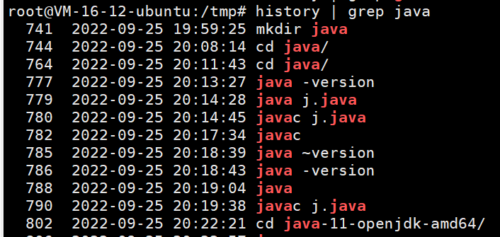
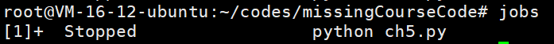
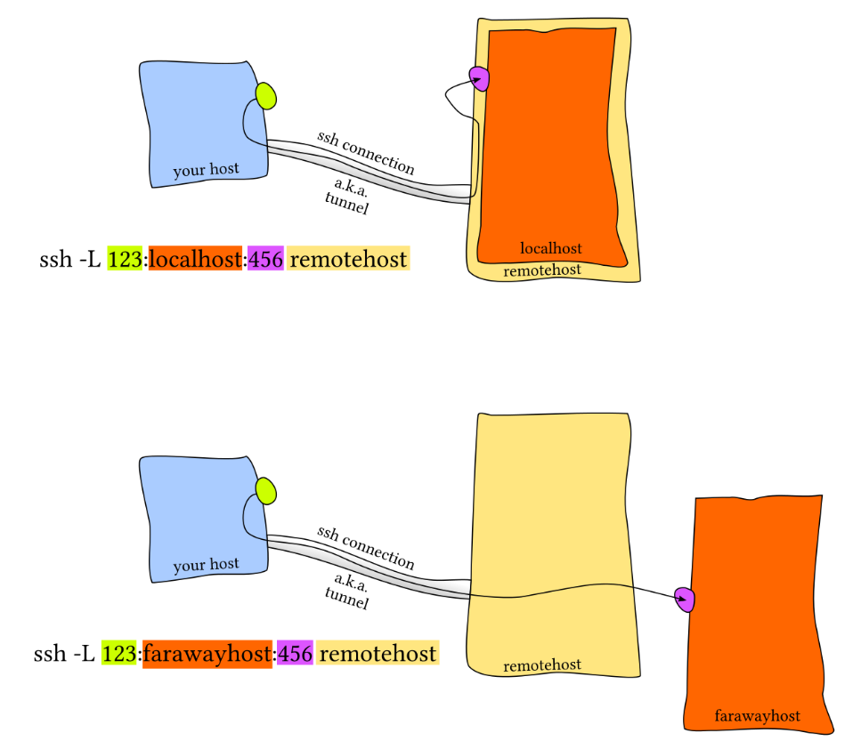

# 计算机教育缺失的一课

## ch1-The Shell

### 1. 使用shell

一个简单的shell命令的示例

```shell
missing:~$ date
Fri 10 Jan 2020 11:49:31 AM EST
missing:~$ 
```

执行了 `date` 这个程序，不出意料地，它打印出了当前的日期和时间。然后，shell 等待我们输入其他命令。我们可以在执行命令的同时向程序传递 *参数* ：

```shell
missing:~$ echo hello
hello
```

`echo` 程序将该参数打印出来。 shell 基于空格分割命令并进行解析，然后执行第一个单词代表的程序，并将后续的单词作为程序可以访问的参数。如果您希望传递的参数中包含空格（例如一个名为 My Photos 的文件夹），您要么用使用单引号，双引号将其包裹起来，要么使用转义符号 `\` 进行处理（`My\ Photos`）。

上例中，我们让 shell 执行 `echo` ，同时指定参数 `hello`。`echo` 程序将该参数打印出来。 shell 基于空格分割命令并进行解析，然后执行第一个单词代表的程序，并将后续的单词作为程序可以访问的参数。如果您希望传递的参数中包含空格（例如一个名为 My Photos 的文件夹），您要么用使用单引号，双引号将其包裹起来，要么使用转义符号 `\` 进行处理（`My\ Photos`）。

> shell 是如何知道去哪里寻找 `date` 或 `echo` 的呢

类似于 Python 或 Ruby，shell 是一个编程环境，所以它具备变量、条件、循环和函数（下一课进行讲解）。当你在 shell 中执行命令时，您实际上是在执行一段 shell 可以解释执行的简短代码。如果你要求 shell 执行某个指令，但是该指令并不是 shell 所了解的编程关键字，那么它会去咨询 *环境变量* `$PATH`，它会列出当 shell 接到某条指令时，进行程序搜索的路径

```shell
missing:~$ echo $PATH
/usr/local/sbin:/usr/local/bin:/usr/sbin:/usr/bin:/sbin:/bin
missing:~$ which echo
/bin/echo
missing:~$ /bin/echo $PATH
/usr/local/sbin:/usr/local/bin:/usr/sbin:/usr/bin:/sbin:/bin
```

当我们执行 `echo` 命令时，shell 了解到需要执行 `echo` 这个程序，随后它便会在 `$PATH` 中搜索由 `:` 所分割的一系列目录，基于名字搜索该程序。当找到该程序时便执行（假定该文件是 *可执行程序*，后续课程将详细讲解）。确定某个程序名代表的是哪个具体的程序，可以使用 `which` 程序。我们也可以绕过 `$PATH`，通过直接指定需要执行的程序的路径来执行该程序

### 2. 在shell中导航

shell 中的路径是一组被分割的目录，在 Linux 和 macOS 上使用 `/` 分割，而在Windows上是 `\`。路径 `/` 代表的是系统的根目录，所有的文件夹都包括在这个路径之下。

:warning:如果某个路径以 `/` 开头，那么它是一个 *绝对路径*，其他的都是 *相对路径* 。:warning:相对路径是指相对于当前工作目录的路径，当前工作目录可以使用 `pwd` 命令来获取。此外，切换目录需要使用 `cd` 命令。在路径中，`.` 表示的是当前目录，而 `..` 表示上级目录。

> ls命令

```shell
missing:~$ ls -l /home
drwxr-xr-x 1 missing  users  4096 Jun 15  2019 missing
```

这个参数可以更加详细地列出目录下文件或文件夹的信息。首先，本行第一个字符 `d` 表示 `missing` 是一个目录。然后接下来的九个字符，每三个字符构成一组。 （`rwx`）. 它们分别代表了文件所有者（`missing`），用户组（`users`） 以及其他所有人具有的权限。其中 `-` 表示该用户不具备相应的权限。从上面的信息来看，只有文件所有者可以修改（`w`），`missing` 文件夹 （例如，添加或删除文件夹中的文件）。为了进入某个文件夹，用户需要具备该文件夹以及其父文件夹的“搜索”权限（以“可执行”：`x`）权限表示。为了列出它的包含的内容，用户必须对该文件夹具备读权限（`r`）。对于文件来说，权限的意义也是类似的。注意，`/bin` 目录下的程序在最后一组，即表示所有人的用户组中，均包含 `x` 权限，也就是说任何人都可以执行这些程序。

> man命令

 `man` 会接受一个程序名作为参数，然后将它的文档（用户手册）展现给您。注意，使用 `q` 可以退出该程序。例如：

```shell
missing:~$ man ls
```

### 3. 在程序间创建连接

在 shell 中，程序有两个主要的“流”：它们的输入流和输出流。 当程序尝试读取信息时，它们会从输入流中进行读取，当程序打印信息时，它们会将信息输出到输出流中。 通常，一个程序的输入输出流都是您的终端。也就是，您的键盘作为输入，显示器作为输出。 但是，我们也可以重定向这些流

最简单的重定向是 `< file` 和 `> file`。这两个命令可以将程序的输入输出流分别重定向到文件：

```shell
missing:~$ echo hello > hello.txt
missing:~$ cat hello.txt
hello
missing:~$ cat < hello.txt
hello
missing:~$ cat < hello.txt > hello2.txt
missing:~$ cat hello2.txt
hello
```

还可以使用 `>>` 来向一个文件追加内容。使用管道（ *pipes* ），我们能够更好的利用文件重定向。 `|` 操作符允许我们将一个程序的输出和另外一个程序的输入连接起来：

```shell
missing:~$ ls -l / | tail -n1
drwxr-xr-x 1 root  root  4096 Jun 20  2019 var
missing:~$ curl --head --silent google.com | grep --ignore-case content-length | cut --delimiter=' ' -f2 219
```

### 4. 根用户

`sudo` 命令的作用是让用户可以以 su（super user 或 root 的简写）的身份执行一些操作。 当您遇到拒绝访问（permission denied）的错误时，通常是因为此时您必须是根用户才能操作。然而，请再次确认您是真的要执行此操作

有一件事情是您必须作为根用户才能做的，那就是向 `sysfs` 文件写入内容。系统被挂载在 `/sys` 下，`sysfs` 文件则暴露了一些内核（kernel）参数。 因此，您不需要借助任何专用的工具，就可以轻松地在运行期间配置系统内核。**注意 Windows 和 macOS 没有这个文件**。

## ch2-Shell工具和脚本

### 1. shell脚本概念

大多数shell都有自己的一套脚本语言，包括变量、控制流和自己的语法。shell脚本与其他脚本语言不同之处在于，shell 脚本针对 shell 所从事的相关工作进行来优化。因此，创建命令流程（pipelines）、将结果保存到文件、从标准输入中读取输入，这些都是 shell 脚本中的原生操作，这让它比通用的脚本语言更易用。

在bash中为变量赋值的语法是`foo=bar`，访问变量中存储的数值，其语法为 `$foo`。 需要注意的是，`foo = bar` （使用空格隔开）是不能正确工作的，因为解释器会调用程序`foo` 并将 `=` 和 `bar`作为参数。 总的来说，在shell脚本中使用空格会起到分割参数的作用，有时候可能会造成混淆，请务必多加检查。

Bash中的字符串通过`'` 和 `"`分隔符来定义，但是它们的含义并不相同：

- 以`'`定义的字符串为原义字符串，其中的变量不会被转义
-  `"`定义的字符串会将变量值进行替换。

Bash中的字符串通过`'` 和 `"`分隔符来定义，但是它们的含义并不相同。以`'`定义的字符串为原义字符串，其中的变量不会被转义，而 `"`定义的字符串会将变量值进行替换。

```bash
foo=bar
echo "$foo"
# 打印 bar
echo '$foo'
# 打印 $foo
```

和其他大多数的编程语言一样，`bash`也支持`if`, `case`, `while` 和 `for` 这些控制流关键字。同样地， `bash` 也支持函数，它可以接受参数并基于参数进行操作。下面这个函数是一个例子，它会创建一个文件夹并使用`cd`进入该文件夹。

```bash
mcd () {
    mkdir -p "$1"
    cd "$1"
}
```

`bash`也支持`if`, `case`, `while` 和 `for` 这些控制流关键字。同样地， `bash` 也支持函数，它可以接受参数并基于参数进行操作。下面这个函数是一个例子，它会创建一个文件夹并使用`cd`进入该文件夹。

```bash
mcd () {
    mkdir -p "$1"
    cd "$1"
}
```

这里 `$1` 是脚本的第一个参数。与其他脚本语言不同的是，bash使用了很多特殊的变量来表示参数、错误代码和相关变量。下面是列举来其中一些变量，更完整的列表可以参考 [这里](https://www.tldp.org/LDP/abs/html/special-chars.html)。

- `$0` - 脚本名
- `$1` 到 `$9` - 脚本的参数。 `$1` 是第一个参数，依此类推。
- `$@` - 所有参数
- `$#` - 参数个数
- `$?` - 前一个命令的返回值
- `$$` - 当前脚本的进程识别码
- `!!` - 完整的上一条命令，包括参数。常见应用：当你因为权限不足执行命令失败时，可以使用 `sudo !!`再尝试一次。
- `$_` - 上一条命令的最后一个参数。如果你正在使用的是交互式 shell，你可以通过按下 `Esc` 之后键入 . 来获取这个值。

命令通常使用 `STDOUT`来返回输出值，使用`STDERR` 来返回错误及错误码，便于脚本以更加友好的方式报告错误。 返回码或退出状态是脚本/命令之间交流执行状态的方式。返回值0表示正常执行，其他所有非0的返回值都表示有错误发生。

退出码可以搭配 `&&`（与操作符）和 `||`（或操作符）使用，用来进行条件判断，决定是否执行其他程序。它们都属于短路[运算符](https://en.wikipedia.org/wiki/Short-circuit_evaluation)（short-circuiting） 同一行的多个命令可以用` ; `分隔。程序 `true` 的返回码永远是`0`，`false` 的返回码永远是`1`。让我们看几个例子:

```bash
false || echo "Oops, fail"
# Oops, fail

true || echo "Will not be printed"
#

true && echo "Things went well"
# Things went well

false && echo "Will not be printed"
#

false ; echo "This will always run"
# This will always run
```

另一个常见的模式是以变量的形式获取一个命令的输出，这可以通过 *命令替换*（*command substitution*）实现。

当您通过 `$( CMD )` 这样的方式来执行`CMD` 这个命令时，它的输出结果会替换掉 `$( CMD )` 。例如，如果执行 `for file in $(ls)` ，shell首先将调用`ls` ，然后遍历得到的这些返回值。还有一个冷门的类似特性是 *进程替换*（*process substitution*）， `<( CMD )` 会执行 `CMD` 并将结果输出到一个临时文件中，并将 `<( CMD )` 替换成临时文件名。这在我们希望返回值通过文件而不是STDIN传递时很有用。例如， `diff <(ls foo) <(ls bar)` 会显示文件夹 `foo` 和 `bar` 中文件的区别。

说了很多，现在该看例子了，下面这个例子展示了一部分上面提到的特性。这段脚本会遍历我们提供的参数，使用`grep` 搜索字符串 `foobar`，如果没有找到，则将其作为注释追加到文件中。

```bash
#!/bin/bash

echo "Starting program at $(date)" # date会被替换成日期和时间

echo "Running program $0 with $# arguments with pid $$"

for file in "$@"; do
    grep foobar "$file" > /dev/null 2> /dev/null
    # 如果模式没有找到，则grep退出状态为 1
    # 我们将标准输出流和标准错误流重定向到Null，因为我们并不关心这些信息
    # 在bash中进行比较时，尽量使用双方括号 [[ ]] 而不是单方括号 [ ]，这样会降低犯错的几率，尽管这样并不能兼容 sh
    if [[ $? -ne 0 ]]; then
        echo "File $file does not have any foobar, adding one"
        echo "# foobar" >> "$file"
    fi
done
```

> shell的通配

当执行脚本时，我们经常需要提供形式类似的参数。bash使我们可以轻松的实现这一操作，它可以基于文件扩展名展开表达式。这一技术被称为shell的 *通配*（*globbing*）：

- 通配符 - 当你想要利用通配符进行匹配时，你可以分别使用 `?` 和 `*` 来匹配**一个**或**任意**个字符。例如，对于文件`foo`, `foo1`, `foo2`, `foo10` 和 `bar`,

    `rm foo?`这条命令会删除`foo1` 和 `foo2` ，而`rm foo*` 则会删除除了`bar`之外的所有文件。

- 花括号`{}` - 当你有一系列的指令，其中包含一段公共子串时，可以用花括号来自动展开这些命令。这在批量移动或转换文件时非常方便：

    ```bash
    convert image.{png,jpg}
    # 会展开为
    convert image.png image.jpg
    
    cp /path/to/project/{foo,bar,baz}.sh /newpath
    # 会展开为
    cp /path/to/project/foo.sh /path/to/project/bar.sh /path/to/project/baz.sh /newpath
    
    # 也可以结合通配使用
    mv *{.py,.sh} folder
    # 会移动所有 *.py 和 *.sh 文件
    
    mkdir foo bar
    
    # 下面命令会创建foo/a, foo/b, ... foo/h, bar/a, bar/b, ... bar/h这些文件
    touch {foo,bar}/{a..h}
    touch foo/x bar/y
    # 比较文件夹 foo 和 bar 中包含文件的不同
    diff <(ls foo) <(ls bar)
    # 输出
    # < x
    # ---
    # > y
    ```

    > 注意：脚本并不一定只有用 bash 写才能在终端里调用

比如说，这是一段 Python 脚本，作用是将输入的参数倒序输出：

```python
#!/usr/local/bin/python
import sys
for arg in reversed(sys.argv[1:]):
    print(arg)
```

内核知道去用 python 解释器而不是 shell 命令来运行这段脚本，是因为脚本的开头第一行的 [shebang](https://en.wikipedia.org/wiki/Shebang_(Unix))。

在 `shebang` 行中使用 [`env`](https://man7.org/linux/man-pages/man1/env.1.html) 命令是一种好的实践，它会利用环境变量中的程序来解析该脚本，这样就提高来您的脚本的可移植性。`env` 会利用我们第一节讲座中介绍过的`PATH` 环境变量来进行定位。 例如，使用了`env`的shebang看上去是这样的`#!/usr/bin/env python`。

> 解释伴随行shebang

Shebang通常出现在类Unix系统的脚本中第一行，作为前两个字符。在Shebang之后，可以有一个或数个空白字符，后接解释器的绝对路径，用于指明执行这个脚本文件的解释器。在直接调用脚本时，系统的程序载入器会分析 Shebang 后的内容，将这些内容作为解释器指令，并调用该指令，将载有 Shebang 的文件路径作为该解释器的参数，执行脚本，从而使得脚本文件的调用方式与普通的可执行文件类似。例如，以指令`#!/bin/sh`开头的文件，在执行时会实际调用 /bin/sh 程序（通常是 Bourne shell 或兼容的 shell，例如 bash、dash 等）来执行。
由于 # 符号在许多脚本语言中都是注释标识符，Shebang 的内容会被这些脚本解释器自动忽略。 在 # 字符不是注释标识符的语言中，例如 Scheme，解释器也可能忽略以 #! 开头的首行内容，以提供与 Shebang 的兼容性。

> shell函数和脚本的不同点

- 函数只能与shell使用相同的语言，脚本可以使用任意语言。因此在脚本中包含 `shebang` 是很重要的。
- 函数仅在定义时被加载，脚本会在每次被执行时加载。这让函数的加载比脚本略快一些，但每次修改函数定义，都要重新加载一次。
- 函数会在当前的shell环境中执行，脚本会在单独的进程中执行。因此，函数可以对环境变量进行更改，比如改变当前工作目录，脚本则不行。脚本需要使用 [`export`](httsp://man7.org/linux/man-pages/man1/export.1p.html) 将环境变量导出，并将值传递给环境变量。
- 与其他程序语言一样，函数可以提高代码模块性、代码复用性并创建清晰性的结构。shell脚本中往往也会包含它们自己的函数定义。

### 2. Shell工具

#### 2.1 查看命令如何使用

1. 最常用的方法是为对应的命令行添加`-h` 或 `--help` 标记。
2. 另外一个更详细的方法则是使用`man` 命令。[`man`](https://man7.org/linux/man-pages/man1/man.1.html) 命令是手册（manual）的缩写，它提供了命令的用户手册。

事实上，目前我们给出的所有命令的说明链接，都是网页版的Linux命令手册。即使是您安装的第三方命令，前提是开发者编写了手册并将其包含在了安装包中。在交互式的、基于字符处理的终端窗口中，一般也可以通过 `:help` 命令或键入 `?` 来获取帮助。

3. 有时候手册内容太过详实，让我们难以在其中查找哪些最常用的标记和语法。 [TLDR pages](https://tldr.sh/) 是一个很不错的替代品，它提供了一些命令最常用的案例，可以帮助您快速找到正确的选项。


#### 2.2 查找文件

（1）find

所有的类UNIX系统都包含一个名为 [`find`](https://man7.org/linux/man-pages/man1/find.1.html) 的工具，它是 shell 上用于查找文件的绝佳工具。`find`命令会递归地搜索符合条件的文件，例如：

```bash
# 查找所有名称为src的文件夹
find . -name src -type d
# 查找所有文件夹路径中包含test的python文件
find . -path '*/test/*.py' -type f
# 查找前一天修改的所有文件
find . -mtime -1
# 查找所有大小在500k至10M的tar.gz文件
find . -size +500k -size -10M -name '*.tar.gz'
```

除了列出所寻找的文件之外，find 还能对所有查找到的文件进行操作。这能极大地简化一些单调的任务。

```bash
# 删除全部扩展名为.tmp 的文件
find . -name '*.tmp' -exec rm {} \;
# 查找全部的 PNG 文件并将其转换为 JPG
find . -name '*.png' -exec convert {} {}.jpg \;
```

（2）fd

[`fd`](https://github.com/sharkdp/fd) 是一个更简单、更快速、更友好的程序，它可以用来作为`find`的替代品。它有很多不错的默认设置，例如输出着色、默认支持正则匹配、支持unicode并且我认为它的语法更符合直觉。以模式`PATTERN` 搜索的语法是 `fd PATTERN`。

（3）locate

`locate` 使用一个由 [`updatedb`](https://man7.org/linux/man-pages/man1/updatedb.1.html)负责更新的数据库，在大多数系统中 `updatedb` 都会通过 [`cron`](https://man7.org/linux/man-pages/man8/cron.8.html) 每日更新。这便需要我们在速度和时效性之间作出权衡。而且，`find` 和类似的工具可以通过别的属性比如文件大小、修改时间或是权限来查找文件，`locate`则只能通过文件名。 [这里](https://unix.stackexchange.com/questions/60205/locate-vs-find-usage-pros-and-cons-of-each-other)有一个更详细的对比。

#### 2.3 查找代码

很多类UNIX的系统都提供了[`grep`](https://man7.org/linux/man-pages/man1/grep.1.html)命令，它是用于对输入文本进行匹配的通用工具。

`grep` 有很多选项，这也使它成为一个非常全能的工具。其中经常使用的有 `-C` ：获取查找结果的上下文（Context）；`-v` 将对结果进行反选（Invert），也就是输出不匹配的结果。举例来说， `grep -C 5` 会输出匹配结果前后五行。当需要搜索大量文件的时候，使用 `-R` 会递归地进入子目录并搜索所有的文本文件。

#### 2.4 查找shell命令

`history` 命令允许您以程序员的方式来访问shell中输入的历史命令。这个命令会在标准输出中打印shell中的里面命令。如果我们要搜索历史记录，则可以利用管道将输出结果传递给 `grep` 进行模式搜索。例如 `history | grep find` 会打印包含find子串的命令：



对于大多数的shell来说，也可以使用 `Ctrl+R` 对命令历史记录进行回溯搜索。敲 `Ctrl+R` 后可以输入子串来自动利用`history | grep xxx`进行匹配，查找历史命令行。

> 递归的查找文件夹中最近使用的文件
>
> 更通用的做法，按照最近的使用时间列出文件

```bash
find . -type f -print0 | xargs -0 ls -lt | head -1
```

当文件数量较多时，上面的命令会得出错误结果，解决办法是增加 `-mmin `条件，先将最近修改的文件进行初步筛选再交给ls进行排序显示 :

```bash
find . -type f -mmin -60 -print0 | xargs -0 ls -lt | head -10
```

#### 2.5 文件夹导航

如何高效地在目录 间随意切换呢？有很多简便的方法可以做到，比如设置alias，使用 [ln -s](https://man7.org/linux/man-pages/man1/ln.1.html) 创建符号连接等。

更简便的，使用[`fasd`](https://github.com/clvv/fasd)和 [autojump](https://github.com/wting/autojump) 这两个工具来查找最常用或最近使用的文件和目录。

Fasd 基于 [*frecency* ](https://developer.mozilla.org/en-US/docs/Mozilla/Tech/Places/Frecency_algorithm)对文件和文件排序，也就是说它会同时针对频率（*frequency*）和时效（*recency*）进行排序。默认情况下，`fasd`使用命令 `z` 帮助我们快速切换到最常访问的目录。例如， 如果您经常访问`/home/user/files/cool_project` 目录，那么可以直接使用 `z cool` 跳转到该目录。对于 autojump，则使用`j cool`代替即可。

## ch3-Vim

### 1. Vim的哲学

Vim 是一个能跟上思维速度的编辑器。

Vim 是一个*多模态*编辑器：它对于插入文字和操纵文字有不同的模式。Vim 是可编程的（可以使用 Vimscript 或者像 Python 一样的其他程序语言），Vim 的接口本身也是一个程序语言：键入操作（以及其助记名） 是命令，这些命令也是可组合的。Vim 避免了使用鼠标，因为那样太慢了；Vim 甚至避免用 上下左右键因为那样需要太多的手指移动。

### 2. 编辑模式

多种操作模式：

1. **正常模式**：在文件中四处移动光标进行修改
2. **插入模式**：插入文本
3. **替换模式**：替换文本
4. **可视化模式**（一般，行，块）：选中文本块
5. **命令模式**：用于执行命令

在默认设置下，Vim 会在左下角显示当前的模式。Vim 启动时的默认模式是正常模式。

1. 可以按下 `<ESC>`（退出键）从任何其他模式返回正常模式
2. 在正常模式，键入 `i` 进入插入 模式
3. `R` 进入替换模式
4. `v` 进入可视（一般）模式，`V` 进入可视（行）模式，`<C-v>` （Ctrl-V, 有时也写作 `^V`）进入可视（块）模式
5. `:` 进入命令模式。

### 3. 基本操作

#### 3.1 插入文本

在正常模式，键入 `i` 进入插入模式。现在 Vim 跟很多其他的编辑器一样，直到你键入 `<ESC>` 返回正常模式

#### 3.2 缓存，标签页和窗口

Vim 会维护一系列打开的文件，称为“缓存”。一个 Vim 会话包含一系列标签页，每个标签页包含 一系列窗口（分隔面板）。每个窗口显示一个缓存。跟网页浏览器等其他你熟悉的程序不一样的是， 缓存和窗口不是一一对应的关系；窗口只是视角。一个缓存可以在*多个*窗口打开，甚至在同一 个标签页内的多个窗口打开。这个功能其实很好用，比如在查看同一个文件的不同部分的时候。

Vim 默认打开一个标签页，这个标签也包含一个窗口。

#### 3.3 命令行

在正常模式下键入 `:` 进入命令行模式。 在键入 `:` 后，你的光标会立即跳到屏幕下方的命令行。 这个模式有很多功能，包括打开，保存，关闭文件，以及 [退出 Vim](https://twitter.com/iamdevloper/status/435555976687923200)。

1. `:q` 退出（关闭窗口）
2. `:w` 保存（写）
3. `:wq` 保存然后退出
4. `:e {文件名}` 打开要编辑的文件
5. `:ls` 显示打开的缓存
6. `:help {标题}` 打开帮助文档
    1. `:help :w` 打开 `:w` 命令的帮助文档
    2. `:help w` 打开 `w` 移动的帮助文档

### 4. Vim 的接口其实是一种编程语言

#### 4.1 移动

多数时候你会在正常模式下，使用移动命令在缓存中导航。在 Vim 里面移动也被称为 “名词”， 因为它们指向文字块。

- 基本移动: `hjkl` （左， 下， 上， 右）
- 词： `w` （下一个词）， `b` （词初）， `e` （词尾）
- 行： `0` （行初）， `^` （第一个非空格字符）， `$` （行尾）
- 屏幕： `H` （屏幕首行）， `M` （屏幕中间）， `L` （屏幕底部）
- :warning:常用:warning:翻页： `Ctrl-u` （上翻）， `Ctrl-d` （下翻）
- :warning:常用:warning:文件： `gg` （文件头）， `G` （文件尾）
- 行数： `:{行数}<CR>` 或者 `{行数}G` ({行数}为行数)
- 杂项： `%` （找到配对，比如括号或者 /* */ 之类的注释对）
- 查找： `f{字符}`， `t{字符}`， `F{字符}`， `T{字符}`
    - 查找/到 向前/向后 在本行的{字符}
    - `,` / `;` 用于导航匹配
- :warning:常用:warning:搜索: `/{正则表达式}`, `n` / `N` 用于导航匹配

#### 4.2 选择

可视化模式:

- 可视化：`v`
- 可视化行： `V`
- 可视化块：`Ctrl+v`

可以用移动命令来选中。

#### 4.3 编辑

所有你需要用鼠标做的事， 你现在都可以用键盘：采用编辑命令和移动命令的组合来完成。 这就是 Vim 的界面开始看起来像一个程序语言的时候。Vim 的编辑命令也被称为 “动词”， 因为动词可以施动于名词。

- i进入插入模式
    - 但是对于操纵/编辑文本，不单想用退格键完成
- `O` / `o` 在之上/之下插入行
- d{移动命令}删除 {移动命令}
    - 例如，`dw` 删除词, `d$` 删除到行尾, `d0` 删除到行头。
- c{移动命令}改变 {移动命令}
    - 例如，`cw` 改变词
    - 比如 `d{移动命令}` 再 `i`
- `x` 删除字符（等同于 `dl`）
- `s` 替换字符（等同于 `xi`）
- 可视化模式 + 操作
    - 选中文字, `d` 删除 或者 `c` 改变
- `u` 撤销, `<C-r>` 重做
- `y` 复制 / “yank” （其他一些命令比如 `d` 也会复制）
- `p` 粘贴
- 更多值得学习的: 比如 `~` 改变字符的大小写

#### 4.4 计数

可以用一个计数来结合“名词”和“动词”，这会执行指定操作若干次。

- `3w` 向前移动三个词
- `5j` 向下移动5行
- `7dw` 删除7个词

#### 4.5 修饰语

你可以用修饰语改变“名词”的意义。修饰语有 `i`，表示“内部”或者“在内“，和 `a`， 表示”周围“。

- `ci(` 改变当前括号内的内容
- `ci[` 改变当前方括号内的内容
- `da'` 删除一个单引号字符串， 包括周围的单引号

### 5. 自定义Vim

Vim 由一个位于 `~/.vimrc` 的文本配置文件（包含 Vim 脚本命令）。

### 6. 扩展Vim

从 Vim 8.0 开始可以使用内置的插件管理系统。只需要创建一个 `~/.vim/pack/vendor/start/` 的文件夹，然后把插件放到这里（比如通过 `git clone`）。

[Vim Awesome](https://vimawesome.com/) 有各种很棒的插件。 这个话题也有很多博客文章：搜索 “best Vim plugins”。

### 7. 扩展资料

- `vimtutor` 是一个 Vim 安装时自带的教程
- [Vim Adventures](https://vim-adventures.com/) 是一个学习使用 Vim 的游戏
- [Vim Tips Wiki](http://vim.wikia.com/wiki/Vim_Tips_Wiki)
- [Vim Advent Calendar](https://vimways.org/2019/) 有很多 Vim 小技巧
- [Vim Golf](http://www.vimgolf.com/) 是用 Vim 的用户界面作为程序语言的 [code golf](https://en.wikipedia.org/wiki/Code_golf)
- [Vi/Vim Stack Exchange](https://vi.stackexchange.com/)
- [Vim Screencasts](http://vimcasts.org/)
- [Practical Vim](https://pragprog.com/titles/dnvim2/)（书籍）

## ch4-数据整理

### 1. 正则表达式

例如`/.*Disconnected from /`。正则表达式通常以（尽管并不总是） `/`开始和结束。大多数的 ASCII 字符都表示它们本来的含义，但是有一些字符确实具有表示匹配行为的“特殊”含义。不同字符所表示的含义，根据正则表达式的实现方式不同，也会有所变化。常见的模式有：

- `.` 除换行符之外的”任意单个字符”
- `*` 匹配前面字符零次或多次
- `+` 匹配前面字符一次或多次
- `[abc]` 匹配 `a`, `b` 和 `c` 中的任意一个
- `(RX1|RX2)` 任何能够匹配`RX1` 或 `RX2`的结果
- `^` 行首
- `$` 行尾

## ch5-命令行环境

在本章中学习如何同时执行多个不同的进程并追踪它们的状态、如何停止或暂停某个进程以及如何使进程在后台运行。

还包括一些能够改善您的 shell 及其他工具的工作流的方法，这主要是通过定义别名或基于配置文件对其进行配置来实现的。这些方法都可以帮您节省大量的时间。例如，仅需要执行一些简单的命令，我们就可以在所有的主机上使用相同的配置。我们还会学习如何使用 SSH 操作远端机器。

### 1. 任务控制

#### 1.1 结束进程

shell 会使用 UNIX 提供的**信号机制执行进程间通信**。当一个进程接收到信号时，它会停止执行、处理该信号并基于信号传递的信息来改变其执行。就这一点而言，信号是一种*软件中断*。例如，当我们输入 `Ctrl-C` 时，shell 会发送一个`SIGINT` 信号到进程。

尽管 `SIGINT` 和 `SIGQUIT` 都常常用来发出和终止程序相关的请求。`SIGTERM` 则是一个更加通用的、也更加优雅地退出信号。为了发出这个信号我们需要使用 [`kill`](https://www.man7.org/linux/man-pages/man1/kill.1.html) 命令, 它的语法是： `kill -TERM <PID>`。

#### 1.2 暂停和后台执行进程

信号可以让进程做其他的事情，而不仅仅是终止它们。例如，`SIGSTOP` 会让进程暂停。在终端中，键入 `Ctrl-Z` 会让 shell 发送 `SIGTSTP` 信号，`SIGTSTP`是 Terminal Stop 的缩写（即`terminal`版本的SIGSTOP）

:warning:可以使用 [`fg`](https://www.man7.org/linux/man-pages/man1/fg.1p.html) 或 [`bg`](http://man7.org/linux/man-pages/man1/bg.1p.html) 命令恢复暂停的工作。它们分别表示在前台继续或在后台继续。:warning:


[`jobs`](http://man7.org/linux/man-pages/man1/jobs.1p.html) 命令会列出当前终端会话中尚未完成的全部任务。您可以使用 pid 引用这些任务（也可以用 [`pgrep`](https://www.man7.org/linux/man-pages/man1/pgrep.1.html) 找出 pid）。更加符合直觉的操作是您可以使用百分号 + 任务编号（`jobs` 会打印任务编号）来选取该任务。如果要选择最近的一个任务，可以使用 `$!` 这一特殊参数。



命令中的 `&` 后缀可以让命令在直接在后台运行，这使得您可以直接在 shell 中继续做其他操作，不过它此时还是会使用 shell 的标准输出，这一点有时会比较恼人（这种情况可以使用 shell 重定向处理）。

让已经在运行的进程转到后台运行，您可以键入`Ctrl-Z` ，然后紧接着再输入`bg`。注意，后台的进程仍然是您的终端进程的子进程，一旦您关闭终端（会发送另外一个信号`SIGHUP`），这些后台的进程也会终止。为了防止这种情况发生，您可以使用 [`nohup`](https://www.man7.org/linux/man-pages/man1/nohup.1.html) (一个用来忽略 `SIGHUP` 的封装) 来运行程序。针对已经运行的程序，可以使用`disown` 。除此之外，您可以使用终端多路复用器来实现，下一章节会进行详细地探讨。

下面这个简单的会话中展示来了些概念的应用。

```bash
$ sleep 1000
^Z
[1]  + 18653 suspended  sleep 1000

$ nohup sleep 2000 &
[2] 18745
appending output to nohup.out

$ jobs
[1]  + suspended  sleep 1000
[2]  - running    nohup sleep 2000

$ bg %1
[1]  - 18653 continued  sleep 1000

$ jobs
[1]  - running    sleep 1000
[2]  + running    nohup sleep 2000

$ kill -STOP %1
[1]  + 18653 suspended (signal)  sleep 1000

$ jobs
[1]  + suspended (signal)  sleep 1000
[2]  - running    nohup sleep 2000

$ kill -SIGHUP %1
[1]  + 18653 hangup     sleep 1000

$ jobs
[2]  + running    nohup sleep 2000

$ kill -SIGHUP %2

$ jobs
[2]  + running    nohup sleep 2000

$ kill %2
[2]  + 18745 terminated  nohup sleep 2000

$ jobs
```

`SIGKILL` 是一个特殊的信号，它不能被进程捕获并且它会马上结束该进程。不过这样做会有一些副作用，例如留下孤儿进程。

### 2. 终端多路复用（以tmux为例）

现在最流行的终端多路器是 [`tmux`](https://www.man7.org/linux/man-pages/man1/tmux.1.html)。`tmux` 是一个高度可定制的工具，可以使用相关快捷键创建多个标签页并在它们间导航。像 [`tmux`](https://www.man7.org/linux/man-pages/man1/tmux.1.html) 这类的终端多路复用器可以允许我们基于面板和标签分割出多个终端窗口，这样的好处是：

1. 可以同时与多个 shell 会话进行交互
2. 使我们可以分离当前终端会话并在将来重新连接。

`tmux` 的快捷键都是类似 `<C-b> x` 这样的组合，即需要先按下`Ctrl+b`，松开后再按下 `x`。`tmux` 中对象的继承结构如下：

- 会话：每个会话都是一个独立的工作区，其中包含一个或多个窗口
    - `tmux` 开始一个新的会话
    - `tmux new -s NAME` 以指定名称开始一个新的会话
    - `tmux ls` 列出当前所有会话
    - 在 `tmux` 中输入 `<C-b> d` ，将当前会话分离
    - `tmux a` 重新连接最后一个会话。您也可以通过 `-t` 来指定具体的会话
- 窗口：相当于编辑器或是浏览器中的标签页，从视觉上将一个会话分割为多个部分
    - `<C-b> c` 创建一个新的窗口，使用 `<C-d>`关闭
    - `<C-b> N` 跳转到第 *N* 个窗口，注意每个窗口都是有编号的
    - `<C-b> p` 切换到前一个窗口
    - `<C-b> n` 切换到下一个窗口
    - `<C-b> ,` 重命名当前窗口
    - `<C-b> w` 列出当前所有窗口
- 面板：像 vim 中的分屏一样，面板使我们可以在一个屏幕里显示多个 shell
    - `<C-b> "` 水平分割
    - `<C-b> %` 垂直分割
    - `<C-b> <方向>` 切换到指定方向的面板，<方向> 指的是键盘上的方向键
    - `<C-b> z` 切换当前面板的缩放
    - `<C-b> [` 开始往回卷动屏幕。您可以按下空格键来开始选择，回车键复制选中的部分
    - `<C-b> <空格>` 在不同的面板排布间切换

扩展阅读：

1.  [这里](https://www.hamvocke.com/blog/a-quick-and-easy-guide-to-tmux/) 是一份 `tmux` 快速入门教程
2.  [这里]([Tmux使用手册 | louis blog (louiszhai.github.io)](http://louiszhai.github.io/2017/09/30/tmux/?utm_source=wechat_session&utm_medium=social&utm_oi=1327979382099333120#导读)) 是一份 `tmux` 中文使用手册
3.  [而这一篇](http://linuxcommand.org/lc3_adv_termmux.php) 文章则更加详细，它同时包含了 `screen` 命令（也是一款终端复用软件）。您也许想要掌握 [`screen`](https://www.man7.org/linux/man-pages/man1/screen.1.html) 命令，因为在大多数 UNIX 系统中都默认安装有该程序。

### 3. 别名

 shell 的别名相当于一个长命令的缩写，shell 会自动将其替换成原本的命令。例如，bash 中的别名语法如下：

```shell
alias alias_name="command_to_alias arg1 arg2"
```

注意， `=`两边是没有空格的，因为 [`alias`](https://www.man7.org/linux/man-pages/man1/alias.1p.html) 是一个 shell 命令，它只接受一个参数。

别名有许多很方便的特性:

```shell
# 创建常用命令的缩写
alias ll="ls -lh"

# 能够少输入很多
alias gs="git status"
alias gc="git commit"
alias v="vim"

# 手误打错命令也没关系
alias sl=ls

# 重新定义一些命令行的默认行为
alias mv="mv -i"           # -i prompts before overwrite
alias mkdir="mkdir -p"     # -p make parent dirs as needed
alias df="df -h"           # -h prints human readable format

# 别名可以组合使用
alias la="ls -A"
alias lla="la -l"

# 在忽略某个别名
\ls
# 或者禁用别名
unalias la

# 获取别名的定义
alias ll
# 会打印 ll='ls -lh'
```

值得注意的是，在默认情况下 shell 并不会保存别名。为了让别名持续生效，需要将配置放进 shell 的启动文件里，像是`.bashrc` 或 `.zshrc`，下一节我们就会讲到。

```shell
vim ~/.bashrc
```

### 4. 配置文件

很多程序的配置都是通过纯文本格式的被称作**点文件**的配置文件来完成的（之所以称为点文件，是因为它们的文件名以 `.` 开头，例如 `~/.vimrc`。也正因为此，它们默认是隐藏文件，`ls`并不会显示它们）。

shell 的配置也是通过这类文件完成的。在启动时， shell 程序会读取很多文件以加载其配置项。根据 shell 本身的不同，从登录开始还是以交互的方式完成这一过程可能会有很大的不同。

对于 `bash`来说，在大多数系统下，可以通过编辑 `.bashrc` 或 `.bash_profile` 来进行配置。在文件中您可以添加需要在启动时执行的命令，例如上文我们讲到过的**别名**，或者是您的**环境变量**。

实际上，很多程序都要求您在 shell 的配置文件中包含一行类似 `export PATH="$PATH:/path/to/program/bin"` 的命令，这样才能确保这些程序能够被 shell 找到。

还有一些其他的工具也可以通过*点文件*进行配置：

- `bash` - `~/.bashrc`, `~/.bash_profile`
- `git` - `~/.gitconfig`
- `vim` - `~/.vimrc` 和 `~/.vim` 目录
- `ssh` - `~/.ssh/config`
- `tmux` - `~/.tmux.conf`

> 如何管理配置文件

配置文件它们应该在它们的文件夹下，并使用版本控制系统进行管理，然后通过脚本将其 **符号链接** 到需要的地方。这么做有如下好处：

- **安装简单**: 如果您登录了一台新的设备，在这台设备上应用您的配置只需要几分钟的时间；
- **可以执行**: 您的工具在任何地方都以相同的配置工作
- **同步**: 在一处更新配置文件，可以同步到其他所有地方
- **变更追踪**: 您可能要在整个程序员生涯中持续维护这些配置文件，而对于长期项目而言，版本历史是非常重要的

配置文件中需要放些什么？可以通过在线文档和[帮助手册](https://en.wikipedia.org/wiki/Man_page)了解所使用工具的设置项。另一个方法是在网上搜索有关特定程序的文章，作者们在文章中会分享他们的配置。还有一种方法就是直接浏览其他人的配置文件：您可以在这里找到无数的[dotfiles 仓库](https://github.com/search?o=desc&q=dotfiles&s=stars&type=Repositories) —— 其中最受欢迎的那些可以在[这里](https://github.com/mathiasbynens/dotfiles)找到（我们建议您不要直接复制别人的配置）。[这里](https://dotfiles.github.io/) 也有一些非常有用的资源。

> 可移植性

配置文件的一个常见的痛点是它可能并不能在多种设备上生效。例如，如果您在不同设备上使用的操作系统或者 shell 是不同的，则配置文件是无法生效的。或者，有时您仅希望特定的配置只在某些设备上生效。

有一些技巧可以轻松达成这些目的。如果配置文件 if 语句，则您可以借助它针对不同的设备编写不同的配置。例如，您的 shell 可以这样做：

```shell
if [[ "$(uname)" == "Linux" ]]; then {do_something}; fi

# 使用和 shell 相关的配置时先检查当前 shell 类型
if [[ "$SHELL" == "zsh" ]]; then {do_something}; fi

# 您也可以针对特定的设备进行配置
if [[ "$(hostname)" == "myServer" ]]; then {do_something}; fi
```

如果配置文件支持 include 功能，您也可以多加利用。例如：`~/.gitconfig` 可以这样编写：

```shell
[include]
    path = ~/.gitconfig_local
```

然后我们可以在日常使用的设备上创建配置文件 `~/.gitconfig_local` 来包含与该设备相关的特定配置。您甚至应该创建一个单独的代码仓库来管理这些与设备相关的配置。

如果您希望在不同的程序之间共享某些配置，该方法也适用。例如，如果您想要在 `bash` 和 `zsh` 中同时启用一些别名，您可以把它们写在 `.aliases` 里，然后在这两个 shell 里应用：

```shell
# Test if ~/.aliases exists and source it
if [ -f ~/.aliases ]; then
    source ~/.aliases
fi
```

### 5. 远端设备与SSH

通过如下命令，可以使用 `ssh` 连接到其他服务器：

```shell
ssh foo@bar.mit.edu
```

这里我们尝试以用户名 `foo` 登录服务器 `bar.mit.edu`。服务器可以通过 URL 指定（例如`bar.mit.edu`），也可以使用 IP 指定（例如`foobar@192.168.1.42`）。后面会介绍如何修改 ssh 配置文件使我们可以用类似 `ssh bar` 这样的命令来登录服务器。

#### 5.1 执行命令

`ssh` 的一个经常被忽视的特性是它可以直接远程执行命令。 `ssh foobar@server ls` 可以直接在用foobar的命令下执行 `ls` 命令。 想要配合管道来使用也可以， `ssh foobar@server ls | grep PATTERN` 会在本地查询远端 `ls` 的输出而 `ls | ssh foobar@server grep PATTERN` 会在远端对本地 `ls` 输出的结果进行查询。

#### 5.2 SSH密钥

基于密钥的验证机制使用了密码学中的公钥，我们只需要向服务器证明客户端持有对应的私钥，而不需要公开其私钥。这样您就可以避免每次登录都输入密码的麻烦了秘密就可以登录。不过，私钥(通常是 `~/.ssh/id_rsa` 或者 `~/.ssh/id_ed25519`) 等效于您的密码，所以一定要好好保存它。

> 密钥生成

使用 [`ssh-keygen`](http://man7.org/linux/man-pages/man1/ssh-keygen.1.html) 命令可以生成一对密钥：

```
ssh-keygen -o -a 100 -t ed25519 -f ~/.ssh/id_ed25519
```

您可以为密钥设置密码，防止有人持有您的私钥并使用它访问您的服务器。您可以使用 [`ssh-agent`](https://www.man7.org/linux/man-pages/man1/ssh-agent.1.html) 或 [`gpg-agent`](https://linux.die.net/man/1/gpg-agent) ，这样就不需要每次都输入该密码了。

如果您曾经配置过使用 SSH 密钥推送到 GitHub，那么可能您已经完成了[这里](https://help.github.com/articles/connecting-to-github-with-ssh/)介绍的这些步骤，并且已经有了一个可用的密钥对。要检查您是否持有密码并验证它，您可以运行 `ssh-keygen -y -f /path/to/key`。

> 基于密钥的认证机制

`ssh` 会查询 `.ssh/authorized_keys` 来确认那些用户可以被允许登录。您可以通过下面的命令将一个公钥拷贝到这里：

```shell
cat .ssh/id_ed25519 | ssh foobar@remote 'cat >> ~/.ssh/authorized_keys'
```

如果支持 `ssh-copy-id` 的话，可以使用下面这种更简单的解决方案：

```shell
ssh-copy-id -i .ssh/id_ed25519.pub foobar@remote
```

#### 5.3 通过SSH复制文件

使用 ssh 复制文件有很多方法：

- `ssh+tee`, 最简单的方法是执行 `ssh` 命令，然后通过这样的方法利用标准输入实现 `cat localfile | ssh remote_server tee serverfile`。回忆一下，[`tee`](https://www.man7.org/linux/man-pages/man1/tee.1.html) 命令会将标准输出写入到一个文件；

- [`scp`](https://www.man7.org/linux/man-pages/man1/scp.1.html) ：当需要拷贝大量的文件或目录时，使用`scp` 命令则更加方便，因为它可以方便的遍历相关路径。语法如下：

    `scp path/to/local_file remote_host:path/to/remote_file`；

- [`rsync`](https://www.man7.org/linux/man-pages/man1/rsync.1.html) 对 `scp` 进行了改进，它可以检测本地和远端的文件以防止重复拷贝。它还可以提供一些诸如符号连接、权限管理等精心打磨的功能。甚至还可以基于 `--partial`标记实现断点续传。`rsync` 的语法和`scp`类似。

#### 5.4 端口转发

很多情况下我们都会遇到软件需要监听特定设备的端口。如果是在您的本机，可以使用 `localhost:PORT` 或 `127.0.0.1:PORT`。但是如果需要监听远程服务器的端口该如何操作呢？这种情况下远端的端口并不会直接通过网络暴露给您。

此时就需要进行 *端口转发*。端口转发有两种，本地端口转发和远程端口转发（参见下图，该图片引用自这篇[StackOverflow 文章](https://unix.stackexchange.com/questions/115897/whats-ssh-port-forwarding-and-whats-the-difference-between-ssh-local-and-remot)）中的图片。

本地端口转发：



远程端口转发：


常见的情景是使用本地端口转发，即远端设备上的服务监听一个端口，而您希望在本地设备上的一个端口建立连接并转发到远程端口上。例如，我们在远端服务器上运行 Jupyter notebook 并监听 `8888` 端口。 然后，建立从本地端口 `9999` 的转发，使用 `ssh -L 9999:localhost:8888 foobar@remote_server` 。这样只需要访问本地的 `localhost:9999` 即可。

#### 5.5 SSH配置

更好的方法是使用 `~/.ssh/config`.

```shell
Host vm
    User foobar
    HostName 172.16.174.141
    Port 2222
    IdentityFile ~/.ssh/id_ed25519
    LocalForward 9999 localhost:8888

# 在配置文件中也可以使用通配符
Host *.mit.edu
    User foobaz
```

这么做的好处是，使用 `~/.ssh/config` 文件来创建别名，类似 `scp`、`rsync`和`mosh`的这些命令都可以读取这个配置并将设置转换为对应的命令行选项。

注意，`~/.ssh/config` 文件也可以被当作配置文件，而且一般情况下也是可以被导入其他配置文件的。不过，如果您将其公开到互联网上，那么其他人都将会看到您的服务器地址、用户名、开放端口等等。这些信息可能会帮助到那些企图攻击您系统的黑客，所以请务必三思。

服务器侧的配置通常放在 `/etc/ssh/sshd_config`。您可以在这里配置免密认证、修改 ssh 端口、开启 X11 转发等等。 您也可以为每个用户单独指定配置。

#### 5.6 杂项

连接远程服务器的一个常见痛点是遇到由关机、休眠或网络环境变化导致的掉线。如果连接的延迟很高也很让人讨厌。[Mosh](https://mosh.org/)（即 mobile shell ）对 ssh 进行了改进，它允许连接漫游、间歇连接及智能本地回显。

有时将一个远端文件夹挂载到本地会比较方便， [sshfs](https://github.com/libfuse/sshfs) 可以将远端服务器上的一个文件夹挂载到本地，然后您就可以使用本地的编辑器了。