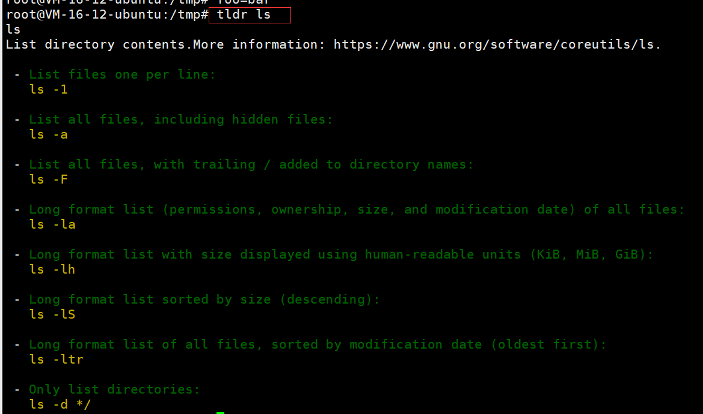

# 计算机教育缺失的一课

## ch1-The Shell

### 1. 使用shell

一个简单的shell命令的示例

```shell
missing:~$ date
Fri 10 Jan 2020 11:49:31 AM EST
missing:~$ 
```

执行了 `date` 这个程序，不出意料地，它打印出了当前的日期和时间。然后，shell 等待我们输入其他命令。我们可以在执行命令的同时向程序传递 *参数* ：

```shell
missing:~$ echo hello
hello
```

`echo` 程序将该参数打印出来。 shell 基于空格分割命令并进行解析，然后执行第一个单词代表的程序，并将后续的单词作为程序可以访问的参数。如果您希望传递的参数中包含空格（例如一个名为 My Photos 的文件夹），您要么用使用单引号，双引号将其包裹起来，要么使用转义符号 `\` 进行处理（`My\ Photos`）。

上例中，我们让 shell 执行 `echo` ，同时指定参数 `hello`。`echo` 程序将该参数打印出来。 shell 基于空格分割命令并进行解析，然后执行第一个单词代表的程序，并将后续的单词作为程序可以访问的参数。如果您希望传递的参数中包含空格（例如一个名为 My Photos 的文件夹），您要么用使用单引号，双引号将其包裹起来，要么使用转义符号 `\` 进行处理（`My\ Photos`）。

> shell 是如何知道去哪里寻找 `date` 或 `echo` 的呢

类似于 Python 或 Ruby，shell 是一个编程环境，所以它具备变量、条件、循环和函数（下一课进行讲解）。当你在 shell 中执行命令时，您实际上是在执行一段 shell 可以解释执行的简短代码。如果你要求 shell 执行某个指令，但是该指令并不是 shell 所了解的编程关键字，那么它会去咨询 *环境变量* `$PATH`，它会列出当 shell 接到某条指令时，进行程序搜索的路径

```shell
missing:~$ echo $PATH
/usr/local/sbin:/usr/local/bin:/usr/sbin:/usr/bin:/sbin:/bin
missing:~$ which echo
/bin/echo
missing:~$ /bin/echo $PATH
/usr/local/sbin:/usr/local/bin:/usr/sbin:/usr/bin:/sbin:/bin
```

当我们执行 `echo` 命令时，shell 了解到需要执行 `echo` 这个程序，随后它便会在 `$PATH` 中搜索由 `:` 所分割的一系列目录，基于名字搜索该程序。当找到该程序时便执行（假定该文件是 *可执行程序*，后续课程将详细讲解）。确定某个程序名代表的是哪个具体的程序，可以使用 `which` 程序。我们也可以绕过 `$PATH`，通过直接指定需要执行的程序的路径来执行该程序

### 2. 在shell中导航

shell 中的路径是一组被分割的目录，在 Linux 和 macOS 上使用 `/` 分割，而在Windows上是 `\`。路径 `/` 代表的是系统的根目录，所有的文件夹都包括在这个路径之下。

:warning:如果某个路径以 `/` 开头，那么它是一个 *绝对路径*，其他的都是 *相对路径* 。:warning:相对路径是指相对于当前工作目录的路径，当前工作目录可以使用 `pwd` 命令来获取。此外，切换目录需要使用 `cd` 命令。在路径中，`.` 表示的是当前目录，而 `..` 表示上级目录。

> ls命令

```shell
missing:~$ ls -l /home
drwxr-xr-x 1 missing  users  4096 Jun 15  2019 missing
```

这个参数可以更加详细地列出目录下文件或文件夹的信息。首先，本行第一个字符 `d` 表示 `missing` 是一个目录。然后接下来的九个字符，每三个字符构成一组。 （`rwx`）. 它们分别代表了文件所有者（`missing`），用户组（`users`） 以及其他所有人具有的权限。其中 `-` 表示该用户不具备相应的权限。从上面的信息来看，只有文件所有者可以修改（`w`），`missing` 文件夹 （例如，添加或删除文件夹中的文件）。为了进入某个文件夹，用户需要具备该文件夹以及其父文件夹的“搜索”权限（以“可执行”：`x`）权限表示。为了列出它的包含的内容，用户必须对该文件夹具备读权限（`r`）。对于文件来说，权限的意义也是类似的。注意，`/bin` 目录下的程序在最后一组，即表示所有人的用户组中，均包含 `x` 权限，也就是说任何人都可以执行这些程序。

> man命令

 `man` 会接受一个程序名作为参数，然后将它的文档（用户手册）展现给您。注意，使用 `q` 可以退出该程序。例如：

```shell
missing:~$ man ls
```

### 3. 在程序间创建连接

在 shell 中，程序有两个主要的“流”：它们的输入流和输出流。 当程序尝试读取信息时，它们会从输入流中进行读取，当程序打印信息时，它们会将信息输出到输出流中。 通常，一个程序的输入输出流都是您的终端。也就是，您的键盘作为输入，显示器作为输出。 但是，我们也可以重定向这些流

最简单的重定向是 `< file` 和 `> file`。这两个命令可以将程序的输入输出流分别重定向到文件：

```shell
missing:~$ echo hello > hello.txt
missing:~$ cat hello.txt
hello
missing:~$ cat < hello.txt
hello
missing:~$ cat < hello.txt > hello2.txt
missing:~$ cat hello2.txt
hello
```

还可以使用 `>>` 来向一个文件追加内容。使用管道（ *pipes* ），我们能够更好的利用文件重定向。 `|` 操作符允许我们将一个程序的输出和另外一个程序的输入连接起来：

```shell
missing:~$ ls -l / | tail -n1
drwxr-xr-x 1 root  root  4096 Jun 20  2019 var
missing:~$ curl --head --silent google.com | grep --ignore-case content-length | cut --delimiter=' ' -f2 219
```

### 4. 根用户

`sudo` 命令的作用是让用户可以以 su（super user 或 root 的简写）的身份执行一些操作。 当您遇到拒绝访问（permission denied）的错误时，通常是因为此时您必须是根用户才能操作。然而，请再次确认您是真的要执行此操作

有一件事情是您必须作为根用户才能做的，那就是向 `sysfs` 文件写入内容。系统被挂载在 `/sys` 下，`sysfs` 文件则暴露了一些内核（kernel）参数。 因此，您不需要借助任何专用的工具，就可以轻松地在运行期间配置系统内核。**注意 Windows 和 macOS 没有这个文件**。

## ch2-Shell工具和脚本

### 1. shell脚本概念

大多数shell都有自己的一套脚本语言，包括变量、控制流和自己的语法。shell脚本与其他脚本语言不同之处在于，shell 脚本针对 shell 所从事的相关工作进行来优化。因此，创建命令流程（pipelines）、将结果保存到文件、从标准输入中读取输入，这些都是 shell 脚本中的原生操作，这让它比通用的脚本语言更易用。

在bash中为变量赋值的语法是`foo=bar`，访问变量中存储的数值，其语法为 `$foo`。 需要注意的是，`foo = bar` （使用空格隔开）是不能正确工作的，因为解释器会调用程序`foo` 并将 `=` 和 `bar`作为参数。 总的来说，在shell脚本中使用空格会起到分割参数的作用，有时候可能会造成混淆，请务必多加检查。

Bash中的字符串通过`'` 和 `"`分隔符来定义，但是它们的含义并不相同：

- 以`'`定义的字符串为原义字符串，其中的变量不会被转义
-  `"`定义的字符串会将变量值进行替换。

Bash中的字符串通过`'` 和 `"`分隔符来定义，但是它们的含义并不相同。以`'`定义的字符串为原义字符串，其中的变量不会被转义，而 `"`定义的字符串会将变量值进行替换。

```bash
foo=bar
echo "$foo"
# 打印 bar
echo '$foo'
# 打印 $foo
```

和其他大多数的编程语言一样，`bash`也支持`if`, `case`, `while` 和 `for` 这些控制流关键字。同样地， `bash` 也支持函数，它可以接受参数并基于参数进行操作。下面这个函数是一个例子，它会创建一个文件夹并使用`cd`进入该文件夹。

```bash
mcd () {
    mkdir -p "$1"
    cd "$1"
}
```

`bash`也支持`if`, `case`, `while` 和 `for` 这些控制流关键字。同样地， `bash` 也支持函数，它可以接受参数并基于参数进行操作。下面这个函数是一个例子，它会创建一个文件夹并使用`cd`进入该文件夹。

```bash
mcd () {
    mkdir -p "$1"
    cd "$1"
}
```

这里 `$1` 是脚本的第一个参数。与其他脚本语言不同的是，bash使用了很多特殊的变量来表示参数、错误代码和相关变量。下面是列举来其中一些变量，更完整的列表可以参考 [这里](https://www.tldp.org/LDP/abs/html/special-chars.html)。

- `$0` - 脚本名
- `$1` 到 `$9` - 脚本的参数。 `$1` 是第一个参数，依此类推。
- `$@` - 所有参数
- `$#` - 参数个数
- `$?` - 前一个命令的返回值
- `$$` - 当前脚本的进程识别码
- `!!` - 完整的上一条命令，包括参数。常见应用：当你因为权限不足执行命令失败时，可以使用 `sudo !!`再尝试一次。
- `$_` - 上一条命令的最后一个参数。如果你正在使用的是交互式 shell，你可以通过按下 `Esc` 之后键入 . 来获取这个值。

命令通常使用 `STDOUT`来返回输出值，使用`STDERR` 来返回错误及错误码，便于脚本以更加友好的方式报告错误。 返回码或退出状态是脚本/命令之间交流执行状态的方式。返回值0表示正常执行，其他所有非0的返回值都表示有错误发生。

退出码可以搭配 `&&`（与操作符）和 `||`（或操作符）使用，用来进行条件判断，决定是否执行其他程序。它们都属于短路[运算符](https://en.wikipedia.org/wiki/Short-circuit_evaluation)（short-circuiting） 同一行的多个命令可以用` ; `分隔。程序 `true` 的返回码永远是`0`，`false` 的返回码永远是`1`。让我们看几个例子:

```bash
false || echo "Oops, fail"
# Oops, fail

true || echo "Will not be printed"
#

true && echo "Things went well"
# Things went well

false && echo "Will not be printed"
#

false ; echo "This will always run"
# This will always run
```

另一个常见的模式是以变量的形式获取一个命令的输出，这可以通过 *命令替换*（*command substitution*）实现。

当您通过 `$( CMD )` 这样的方式来执行`CMD` 这个命令时，它的输出结果会替换掉 `$( CMD )` 。例如，如果执行 `for file in $(ls)` ，shell首先将调用`ls` ，然后遍历得到的这些返回值。还有一个冷门的类似特性是 *进程替换*（*process substitution*）， `<( CMD )` 会执行 `CMD` 并将结果输出到一个临时文件中，并将 `<( CMD )` 替换成临时文件名。这在我们希望返回值通过文件而不是STDIN传递时很有用。例如， `diff <(ls foo) <(ls bar)` 会显示文件夹 `foo` 和 `bar` 中文件的区别。

说了很多，现在该看例子了，下面这个例子展示了一部分上面提到的特性。这段脚本会遍历我们提供的参数，使用`grep` 搜索字符串 `foobar`，如果没有找到，则将其作为注释追加到文件中。

```bash
#!/bin/bash

echo "Starting program at $(date)" # date会被替换成日期和时间

echo "Running program $0 with $# arguments with pid $$"

for file in "$@"; do
    grep foobar "$file" > /dev/null 2> /dev/null
    # 如果模式没有找到，则grep退出状态为 1
    # 我们将标准输出流和标准错误流重定向到Null，因为我们并不关心这些信息
    # 在bash中进行比较时，尽量使用双方括号 [[ ]] 而不是单方括号 [ ]，这样会降低犯错的几率，尽管这样并不能兼容 sh
    if [[ $? -ne 0 ]]; then
        echo "File $file does not have any foobar, adding one"
        echo "# foobar" >> "$file"
    fi
done
```

> shell的通配

当执行脚本时，我们经常需要提供形式类似的参数。bash使我们可以轻松的实现这一操作，它可以基于文件扩展名展开表达式。这一技术被称为shell的 *通配*（*globbing*）：

- 通配符 - 当你想要利用通配符进行匹配时，你可以分别使用 `?` 和 `*` 来匹配**一个**或**任意**个字符。例如，对于文件`foo`, `foo1`, `foo2`, `foo10` 和 `bar`,

    `rm foo?`这条命令会删除`foo1` 和 `foo2` ，而`rm foo*` 则会删除除了`bar`之外的所有文件。

- 花括号`{}` - 当你有一系列的指令，其中包含一段公共子串时，可以用花括号来自动展开这些命令。这在批量移动或转换文件时非常方便：

    ```bash
    convert image.{png,jpg}
    # 会展开为
    convert image.png image.jpg
    
    cp /path/to/project/{foo,bar,baz}.sh /newpath
    # 会展开为
    cp /path/to/project/foo.sh /path/to/project/bar.sh /path/to/project/baz.sh /newpath
    
    # 也可以结合通配使用
    mv *{.py,.sh} folder
    # 会移动所有 *.py 和 *.sh 文件
    
    mkdir foo bar
    
    # 下面命令会创建foo/a, foo/b, ... foo/h, bar/a, bar/b, ... bar/h这些文件
    touch {foo,bar}/{a..h}
    touch foo/x bar/y
    # 比较文件夹 foo 和 bar 中包含文件的不同
    diff <(ls foo) <(ls bar)
    # 输出
    # < x
    # ---
    # > y
    ```

    > 注意：脚本并不一定只有用 bash 写才能在终端里调用

比如说，这是一段 Python 脚本，作用是将输入的参数倒序输出：

```python
#!/usr/local/bin/python
import sys
for arg in reversed(sys.argv[1:]):
    print(arg)
```

内核知道去用 python 解释器而不是 shell 命令来运行这段脚本，是因为脚本的开头第一行的 [shebang](https://en.wikipedia.org/wiki/Shebang_(Unix))。

在 `shebang` 行中使用 [`env`](https://man7.org/linux/man-pages/man1/env.1.html) 命令是一种好的实践，它会利用环境变量中的程序来解析该脚本，这样就提高来您的脚本的可移植性。`env` 会利用我们第一节讲座中介绍过的`PATH` 环境变量来进行定位。 例如，使用了`env`的shebang看上去是这样的`#!/usr/bin/env python`。

> 解释伴随行shebang

Shebang通常出现在类Unix系统的脚本中第一行，作为前两个字符。在Shebang之后，可以有一个或数个空白字符，后接解释器的绝对路径，用于指明执行这个脚本文件的解释器。在直接调用脚本时，系统的程序载入器会分析 Shebang 后的内容，将这些内容作为解释器指令，并调用该指令，将载有 Shebang 的文件路径作为该解释器的参数，执行脚本，从而使得脚本文件的调用方式与普通的可执行文件类似。例如，以指令`#!/bin/sh`开头的文件，在执行时会实际调用 /bin/sh 程序（通常是 Bourne shell 或兼容的 shell，例如 bash、dash 等）来执行。
由于 # 符号在许多脚本语言中都是注释标识符，Shebang 的内容会被这些脚本解释器自动忽略。 在 # 字符不是注释标识符的语言中，例如 Scheme，解释器也可能忽略以 #! 开头的首行内容，以提供与 Shebang 的兼容性。

> shell函数和脚本的不同点

- 函数只能与shell使用相同的语言，脚本可以使用任意语言。因此在脚本中包含 `shebang` 是很重要的。
- 函数仅在定义时被加载，脚本会在每次被执行时加载。这让函数的加载比脚本略快一些，但每次修改函数定义，都要重新加载一次。
- 函数会在当前的shell环境中执行，脚本会在单独的进程中执行。因此，函数可以对环境变量进行更改，比如改变当前工作目录，脚本则不行。脚本需要使用 [`export`](httsp://man7.org/linux/man-pages/man1/export.1p.html) 将环境变量导出，并将值传递给环境变量。
- 与其他程序语言一样，函数可以提高代码模块性、代码复用性并创建清晰性的结构。shell脚本中往往也会包含它们自己的函数定义。

### 2. Shell工具

#### 2.1 查看命令如何使用

1. 最常用的方法是为对应的命令行添加`-h` 或 `--help` 标记。
2. 另外一个更详细的方法则是使用`man` 命令。[`man`](https://man7.org/linux/man-pages/man1/man.1.html) 命令是手册（manual）的缩写，它提供了命令的用户手册。

事实上，目前我们给出的所有命令的说明链接，都是网页版的Linux命令手册。即使是您安装的第三方命令，前提是开发者编写了手册并将其包含在了安装包中。在交互式的、基于字符处理的终端窗口中，一般也可以通过 `:help` 命令或键入 `?` 来获取帮助。

3. 有时候手册内容太过详实，让我们难以在其中查找哪些最常用的标记和语法。 [TLDR pages](https://tldr.sh/) 是一个很不错的替代品，它提供了一些命令最常用的案例，可以帮助您快速找到正确的选项。



#### 2.2 查找文件

（1）find

所有的类UNIX系统都包含一个名为 [`find`](https://man7.org/linux/man-pages/man1/find.1.html) 的工具，它是 shell 上用于查找文件的绝佳工具。`find`命令会递归地搜索符合条件的文件，例如：

```bash
# 查找所有名称为src的文件夹
find . -name src -type d
# 查找所有文件夹路径中包含test的python文件
find . -path '*/test/*.py' -type f
# 查找前一天修改的所有文件
find . -mtime -1
# 查找所有大小在500k至10M的tar.gz文件
find . -size +500k -size -10M -name '*.tar.gz'
```

除了列出所寻找的文件之外，find 还能对所有查找到的文件进行操作。这能极大地简化一些单调的任务。

```bash
# 删除全部扩展名为.tmp 的文件
find . -name '*.tmp' -exec rm {} \;
# 查找全部的 PNG 文件并将其转换为 JPG
find . -name '*.png' -exec convert {} {}.jpg \;
```

（2）fd

[`fd`](https://github.com/sharkdp/fd) 是一个更简单、更快速、更友好的程序，它可以用来作为`find`的替代品。它有很多不错的默认设置，例如输出着色、默认支持正则匹配、支持unicode并且我认为它的语法更符合直觉。以模式`PATTERN` 搜索的语法是 `fd PATTERN`。

（3）locate

`locate` 使用一个由 [`updatedb`](https://man7.org/linux/man-pages/man1/updatedb.1.html)负责更新的数据库，在大多数系统中 `updatedb` 都会通过 [`cron`](https://man7.org/linux/man-pages/man8/cron.8.html) 每日更新。这便需要我们在速度和时效性之间作出权衡。而且，`find` 和类似的工具可以通过别的属性比如文件大小、修改时间或是权限来查找文件，`locate`则只能通过文件名。 [这里](https://unix.stackexchange.com/questions/60205/locate-vs-find-usage-pros-and-cons-of-each-other)有一个更详细的对比。

#### 2.3 查找代码

很多类UNIX的系统都提供了[`grep`](https://man7.org/linux/man-pages/man1/grep.1.html)命令，它是用于对输入文本进行匹配的通用工具。

`grep` 有很多选项，这也使它成为一个非常全能的工具。其中经常使用的有 `-C` ：获取查找结果的上下文（Context）；`-v` 将对结果进行反选（Invert），也就是输出不匹配的结果。举例来说， `grep -C 5` 会输出匹配结果前后五行。当需要搜索大量文件的时候，使用 `-R` 会递归地进入子目录并搜索所有的文本文件。

#### 2.4 查找shell命令

`history` 命令允许您以程序员的方式来访问shell中输入的历史命令。这个命令会在标准输出中打印shell中的里面命令。如果我们要搜索历史记录，则可以利用管道将输出结果传递给 `grep` 进行模式搜索。例如 `history | grep find` 会打印包含find子串的命令：


对于大多数的shell来说，也可以使用 `Ctrl+R` 对命令历史记录进行回溯搜索。敲 `Ctrl+R` 后可以输入子串来自动利用`history | grep xxx`进行匹配，查找历史命令行。

> 递归的查找文件夹中最近使用的文件
>
> 更通用的做法，按照最近的使用时间列出文件

```bash
find . -type f -print0 | xargs -0 ls -lt | head -1
```

当文件数量较多时，上面的命令会得出错误结果，解决办法是增加 `-mmin `条件，先将最近修改的文件进行初步筛选再交给ls进行排序显示 :

```bash
find . -type f -mmin -60 -print0 | xargs -0 ls -lt | head -10
```

#### 2.5 文件夹导航

如何高效地在目录 间随意切换呢？有很多简便的方法可以做到，比如设置alias，使用 [ln -s](https://man7.org/linux/man-pages/man1/ln.1.html) 创建符号连接等。

更简便的，使用[`fasd`](https://github.com/clvv/fasd)和 [autojump](https://github.com/wting/autojump) 这两个工具来查找最常用或最近使用的文件和目录。

Fasd 基于 [*frecency* ](https://developer.mozilla.org/en-US/docs/Mozilla/Tech/Places/Frecency_algorithm)对文件和文件排序，也就是说它会同时针对频率（*frequency*）和时效（*recency*）进行排序。默认情况下，`fasd`使用命令 `z` 帮助我们快速切换到最常访问的目录。例如， 如果您经常访问`/home/user/files/cool_project` 目录，那么可以直接使用 `z cool` 跳转到该目录。对于 autojump，则使用`j cool`代替即可。